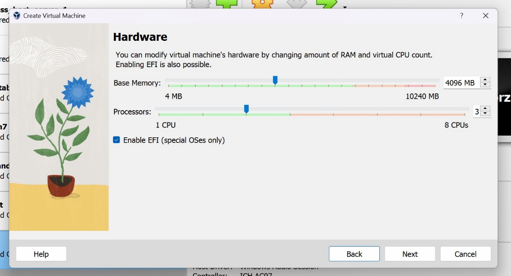
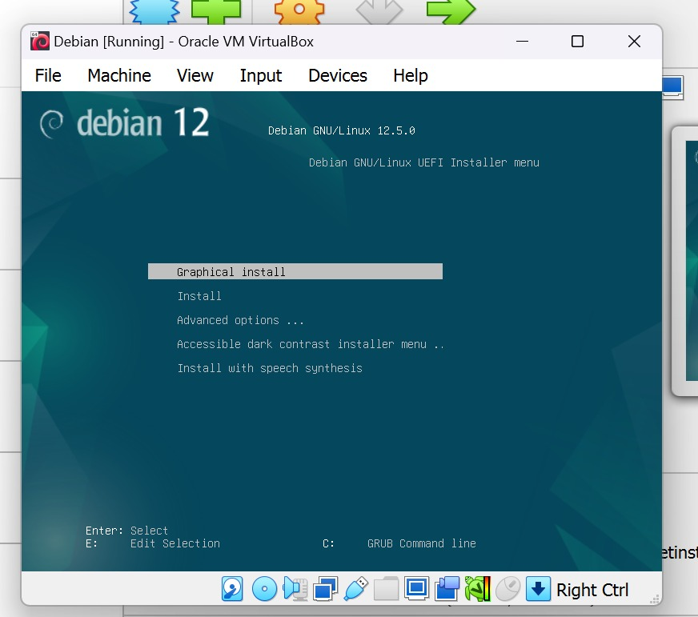

  <h2 style="text-align: center;font-weight: bold">LAPORAN PRAKTIKUM 1 SISTEM OPERASI </h2>
  <h4 style="text-align: center;">Dosen Pengampu : Dr. Ferry Astika Saputra, S.T., M.Sc.</h4>

 

  
  <h3 style="text-align: center;">Disusun Oleh :  Kelompok 7</h3>
  

    <strong>Achmad Risel Araby (3123500025)</strong> 
    <strong>Danur Isa Prabutama (3123500023)</strong> 
    <strong>Fikri Athanabil Efendi (3123500012)</strong>

  

<h3 style="text-align: center;line-height: 1.5">Politeknik Elektronika Negeri Surabaya Departemen Teknik Informatika Dan Komputer Program Studi Teknik Informatika 2024/2025</h3>
  

### Pengertian Sistem Operasi?

Sistem operasi adalah salah satu perangkat lunak paling kompleks,  didalamnya terdapat Kernel yang mengabstraksi fitur-fitur yang disediakan oleh perangkat keras komputer.Peran Sistem Operasi menjadikan fitur-fitur tersebut lebih aman dan nyaman untuk digunakan.

istilah "sistem operasi" biasanya mengacu pada perangkat lunak yang menyediakan antarmuka antara pengguna dan perangkat keras sistem komputer.Sebagai antarmuka antara pengguna dan perangkat keras, sistem operasi harus dirancang dengan mempertimbangkan kebutuhan pengguna serta kendala dan peluang teknologi.

### Soal 

#### Sebutkan dan jelaskan proses booting Komputer!

## Apa itu Proses Booting?

Apa itu booting di OS? Di bagian ini, kita akan mendefinisikan booting di sistem operasi. Saat kita menyalakan komputer, perangkat menerima daya dan diinisialisasi. Pada tahap ini, memori utama, atau RAM, kosong. Untuk memulai sistem, sekumpulan kecil instruksi yang disimpan dalam memori read-only (ROM) dikirim ke unit pemrosesan pusat (CPU) untuk dieksekusi. Petunjuk ini membantu memeriksa komponen perangkat keras dan mengidentifikasi potensi masalah. Jika ada masalah perangkat keras, bunyi bip atau notifikasi di layar mengingatkan kita.

Setelah pemeriksaan perangkat keras selesai, proses booting sistem operasi dimulai. Sistem operasi dimuat, memungkinkan komputer berfungsi dengan baik dan menerima perintah pengguna.Proses booting di OS sangat penting untuk pengoperasian komputer yang memadai dan pelaksanaan berbagai aplikasi perangkat lunak.
booting pada komputer

## Jenis Proses Booting

### 1. Cold Booting

Menyalakan komputer untuk pertama kalinya atau setelah komputer dimatikan sepenuhnya. Saat kita menekan tombol daya untuk memulai cold boot, komputer membaca instruksi Basic Input/Output System (BIOS) yang disimpan di ROM. Instruksi ini memandu sistem dalam memuat sistem operasi ke dalam memori utama. Dibandingkan dengan Warm booting, booting dingin membutuhkan waktu lebih lama karena melibatkan startup sistem yang lengkap.

### 2. Warm Booting

Warm boot, atau reboot, terjadi saat komputer dihidupkan ulang saat dihidupkan. Jenis booting ini biasanya dilakukan ketika sistem hang atau menjadi tidak responsif. Warm booting dapat dimulai melalui perangkat keras, seperti menekan tombol reset, atau perintah perangkat lunak, seperti Ctrl+Alt+Del. Seringkali perlu melakukan boot hangat setelah menginstal perangkat lunak atau perangkat keras baru untuk menerapkan perubahan konfigurasi dan memastikan fungsionalitas sistem yang tepat.

#### * Untuk langkah langkah dari proses booting sistem operasi bisa di lihat di bawah ini:

### 1. Memuat BIOS

Saat kita menyalakan power, langkah pertama dalam proses booting adalah memuat BIOS. Power supply menyediakan listrik ke komponen penting, termasuk prosesor dan BIOS.

### 2. Power-On Self Test (POST)

Setelah memuat BIOS, ia melakukan Power on Self-Test (POST). Tes ini memeriksa memori utama komputer, drive disk, perangkat input/output, dan komponen perangkat keras lainnya. Jika kesalahan terdeteksi selama pengujian, sistem akan mengeluarkan bunyi bip atau menampilkan notifikasi di layar untuk mengingatkan pengguna.

### 3. Memuat Sistem Operasi

Setelah POST berhasil diselesaikan, BIOS membaca urutan bootable yang disimpan dalam CMOS (Common Metal Oxide Semiconductor). Berdasarkan urutan bootable, BIOS mencari Master Boot Record (MBR) pada perangkat yang dapat di-boot seperti floppy disk, CD-ROM, dan hard disk.
Jika MBR tidak ditemukan pada perangkat yang dapat di-boot, sistem akan menampilkan pesan yang mengatakan "Tidak Ada Perangkat Booting Ditemukan" dan crash. Namun, jika MBR ditemukan, BIOS meluncurkan boot loader, perangkat lunak aplikasi khusus yang memuat sistem operasi.

### 4. Konfigurasi Sistem 

Setelah sistem operasi dimuat, driver perangkat dimuat ke dalam memori untuk memastikan pengoperasian komponen perangkat keras komputer dengan benar. Driver perangkat ini bertindak sebagai perantara antara sistem operasi dan perangkat keras, memungkinkan keduanya berkomunikasi secara efektif.

### 5. Memuat Utilitas Sistem

Pada langkah ini, proses booting dalam sistem operasi melibatkan pemuatan utilitas sistem ke dalam memori. Utilitas sistem, seperti perangkat lunak antivirus dan kontrol volume, merupakan alat penting yang meningkatkan fungsionalitas dan keamanan sistem operasi.

### 6. Autentikasi Pengguna

Jika ada otentikasi pengguna yang dikonfigurasi, sistem akan meminta pengguna untuk memasukkan kredensial mereka. Setelah sistem menerima kredensial yang valid, sistem biasanya meluncurkan shell antarmuka pengguna grafis (GUI) atau shell antarmuka baris perintah (CLI), yang memberikan akses pengguna ke sumber daya dan aplikasi sistem.

Enam langkah ini memastikan sistem operasi komputer dimuat dengan benar dan siap digunakan. Dengan memahami proses booting, kita mendapatkan wawasan tentang rangkaian kejadian rumit di balik layar saat kita menghidupkan komputer.

### Referensi 
    - Richard R. Muntz. 1974 June, Operating Systems. https://ieeexplore.ieee.org/document/6323579

    - James Mickens. 2021, Operating Systems. https://read.seas.harvard.edu/cs161/2021/

    - Vibha Gupta. 2003 September 6, Booting in Operating  System (OS): Types, Steps and Process.
      https://www.almabetter.com/bytes/articles/booting-in-operating-system

    - Sunbul. 2023 December 7, Computing System. https://www.redswitches.com/blog/uefi-vs-bios/#what-is-bios

    - geeksforgeeks.org. 2023 July 26, What is a Motherboard?. https://www.geeksforgeeks.org/what-is-a-motherboard/

### Bagaimana cara install Linux Debian di Virtual Box?

#### 1.  Download Virtual Box di <https://www.virtualbox.org/wiki/Downloads>, pilih sesuai system operasi yang kalian gunakan.

#### 2.  Download Debian di <https://www.debian.org/download>

#### 3.  Buka Virtual Box, lalu klik tombol New

#### 4.  Masukkan nama virtual machine, tentukan folder penyimpanan untuk virtual machine, dan pilih file iso Debian yang telah kita download. Kemudian klik tombol next.

#### 5.  Tentukan base memory (RAM) dan jumlah core CPU yang ingin andagunakan, dan centang tulisan *Enable EFI,* lalu klik tombol next.

#### 6.  Tentukan Virtual Hard Disk yang akan digunakan, lalu klik tombol next.

#### 7.  Lalu akan moncul gambar seperti berikut, lalu klik tombol finish.

#### 8.  Pilih virtual machine yang telah kita buat tadi, lalu klik tombol start di kanan atas.

#### 9.  Pilih Graphical Install, lalu klik enter.

#### 10. Pilih Bahasa yang ingin kita gunakan, lalu klik tombol continue.

#### 11. Pilih lokasi kalian, sebagai contoh saya pilih other, kemudian Asia, dan pilih Indonesia. Lalu klik continue.

#### 12. Pilih konfigurasi lokasi, lalu klik continue.

#### 13. Pilih konfigurasi keyboard, lalu klik continue.

#### 14. Tunggu proses loading hingga selesai.

#### 15. Berikan nama Hostname seperti dibawah ini

#### 16. Pilih lokasi other untuk mencari Indonesia
    

#### 17. Selanjutnya pilih Asia

#### 18. Dan pilih Indoneisa

#### 19. Untuk nama domain di kosongi dulu

#### 20. Buatlah pasword untuk root (Super User)

#### 21. Masukan nama lengkap pengguna

#### 22. Konfigurasi username dan password

#### 23. Gunakan password yang aman

#### 24. Konfigurasi pengaturan waktu

#### 25. Dibagian partion disk pilih manual

#### 26. Pilih yang ada size nya

#### 27. Pilih **Yes**

#### 28. Pilih FREE SPACE

#### 29. Pilih opsi create a new partion

#### 30. Berikan size 20GB

#### 31. Pilih primary

#### 32. Pilih Benginning

#### 33. Pastikan Use as Ext4 dan bootable flag dalam keadaan ON dan dengan
    mount point / karena akan menjadi root
    

#### 34. Setelah semua selesai pilih done
    setting
    

#### 35. Pilih Free Space lagi untuk partisi yang
    kedua
    

#### 36. Pilih opsi create a new partion

#### 37. Berikan size 5GB

#### 38. Pilih primary

#### 39. Pilih Benginning

#### 40. Ubah mount pointny dengan cara klik mount point
    

#### 41. Pilih enter manually

#### 42. Ubah menjadi /storage

#### 43. Setelah selesai pilih done partition

#### 44. Pilih Free Space untuk partisi yang
    ketiga
    

#### 45. Pilih opsi create a new partion

#### 46. Berikan size 1.5GB

#### 47. Pilih primary

#### 48. Pilih Benginning

#### 49. Ubah Use as nya menjadi Swap Area

#### 50. Setelah selesai pilih done partition

#### 51. Setelah semua partisi sudah di buat pilih finish
    partitioning
    

#### 52. Pilih **Yes,** pastikan semua partisi sudah benar

#### 53. Tunggu proses sampai selesai

#### 54. Pada menu extra installation media, pilih No
    

#### 55. Pada bagian archive mirror country pilih
    Indonesia
    

#### 56. Pilih kebo.pens.ac.id

#### 57. Untuk bagian proxy dikosongi saja

#### 58. Tunggu proses hingga selesai

#### 59. Pilih Yes di bagian configure popularity contest
    

#### 60. Dibagin software selection dibiarkan defaultnya saja
    

#### 61. Tunggu proses hingga selesai

#### 62. Setelah selesai sistem akan reboot dan debian sudah berhasil diinstal
    

