

  <h2 style="text-align: center;font-weight: bold">LAPORAN PRAKTIKUM * SISTEM OPERASI </h2>
  <h4 style="text-align: center;">Dosen Pengampu : Dr. Ferry Astika Saputra, S.T., M.Sc.</h4>

 

  
  <h3 style="text-align: center;">Disusun Oleh :   Danur Isa Prabutama</h3>

<h3 style="text-align: center;line-height: 1.5">Politeknik Elektronika Negeri Surabaya Departemen Teknik Informatika Dan Komputer Program Studi Teknik Informatika 2024/2025</h3>
  

# Threads

## Ringkasan
Thread adalah aliran urutan tunggal dalam suatu proses. Thread juga disebut proses ringan karena mereka memiliki beberapa sifat proses. Setiap thread dimiliki oleh satu proses. Pada sistem operasi yang mendukung multithreading, prosesnya bisa terdiri dari banyak thread. Tapi thread bisa efektif hanya jika CPU lebih dari 1 jika tidak, dua thread harus beralih konteks untuk satu CPU tersebut.

References : https://www.geeksforgeeks.org/thread-in-operating-system/

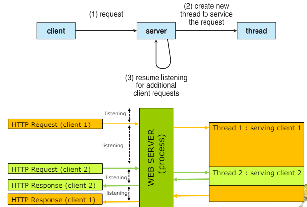

## Multicore Programming
Multicore merupakan teknologi yang memungkinkan prosesor (CPU) memiliki beberapa inti (core) dalam satu chip tunggal. Masing-masing core ini mampu bekerja secara independen, layaknya memiliki beberapa "otak" yang bekerja bersamaan. Hal ini memungkinkan komputer untuk menjalankan banyak program secara lebih efisien dan meningkatkan kecepatan keseluruhan untuk tugas-tugas yang dapat dibagi menjadi beberapa bagian.

References: https://www.geeksforgeeks.org/challanges-in-programming-for-multicore-system/

## Tantangan sistem multicore : 
Karena sistem multicore terdiri dari lebih dari satu prosesor, maka kebutuhannya adalah membuat semuanya sibuk sehingga Anda dapat memanfaatkan beberapa core komputasi dengan lebih baik. Algoritme penjadwalan harus dirancang untuk menggunakan banyak inti komputasi untuk memungkinkan komputasi paralel. Tantangannya juga adalah memodifikasi program multithread yang ada dan yang baru untuk memanfaatkan sistem multicore. 

Secara umum ada lima bidang yang menjadi tantangan dalam pemrograman untuk sistem multicore: 

1. Dividing activities : Tugas perlu diurai menjadi subtugas yang terpisah dan dapat dijalankan secara bersamaan pada core prosesor yang berbeda.Tanpa pembagian tugas yang efektif, multicore tidak akan mencapai potensi penuhnya dan bahkan dapat menyebabkan penurunan kinerja.

2. Balance : Setiap subtugas harus memiliki beban kerja yang hampir sama agar semua core prosesor bekerja secara optimal.

3. Data splitting : Data yang diakses dan dimanipulasi oleh tugas tersebut juga harus dibagi agar dapat dijalankan pada inti yang berbeda. 
 
4. Data dependency : Karena berbagai subtugas yang lebih kecil dijalankan pada inti yang berbeda, ada kemungkinan bahwa satu subtugas bergantung pada data dari subtugas lainnya. Jadi datanya perlu diperiksa dengan baik agar pelaksanaan seluruh tugas bisa sinkron. 

5. Testing and debugging : Ketika berbagai sub-tugas yang lebih kecil dijalankan secara paralel, maka pengujian dan debugging tugas-tugas bersamaan tersebut lebih sulit daripada pengujian dan debugging aplikasi thread tunggal. 

References : https://www.geeksforgeeks.org/challanges-in-programming-for-multicore-system/

### Parallelism (Paralelisme)
sistem dapat mengerjakan lebih dari satu tugas secara bersamaan. Ini berarti tugas-tugas tersebut benar-benar dijalankan pada saat yang sama persis, pada prosesor atau inti (core) yang berbeda.

### Concurrency (Konkurensi)
sistem operasi dengan cepat beralih antar tugas, sehingga memberikan kesan seolah-olah mereka berjalan pada saat yang sama.

References : https://www.geeksforgeeks.org/difference-between-concurrency-and-parallelism/

## Multicore Programming (Cont.)
### Tipe Paralelisme:
- Data Parallelism (Paralelisme Data): membagi-bagi pekerjaan yang sama menjadi potongan kecil.  
- Task Parallelism (Paralelisme Tugas): 

### Concurrency vs. Parallelism
#### Concurrent execution on single-core system:

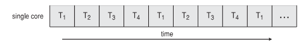

#### Concurrent execution on multi-core system:

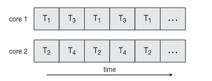

### Single and Multithreaded Processes

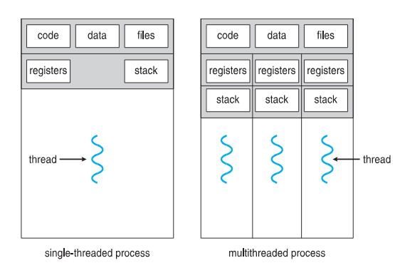

### Amdahl’s Law
-  memprediksi peningkatan kecepatan maksimum teoritis dalam menyelesaikan suatu tugas ketika sumber daya sistem ditingkatkan, dengan beban kerja tetap.
- P - Proporsi program yang dapat diparalelkan (dibagi menjadi subtugas yang dapat dijalankan secara bersamaan).
- S - Faktor percepatan dari bagian paralel program (misalnya, jika bagian paralel menjadi dua kali lebih cepat, S = 2).
- Speedup - Peningkatan kecepatan keseluruhan yang diharapkan.

- N - Jumlah prosesor atau core yang digunakan

Visualisasi: 

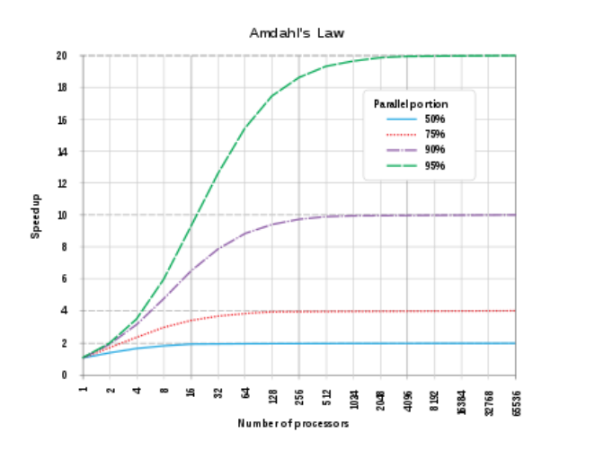

### User Threads and Kernel Threads
- User threads : Dikelola oleh aplikasi itu sendiri, bukan secara langsung oleh sistem operasi.
- Kernel threads : Dikelola oleh kernel, sistem operasi.

### Multithreading Models

#### 1. Many to One

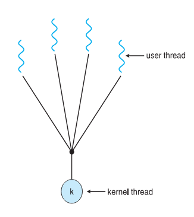

- Banyak user thread dipetakan ke satu kernel thread.
- Seluruh aktivitas user thread ditangani di ruang pengguna (user space) oleh aplikasi.

#### 2. One to One

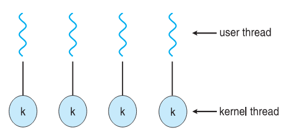

- Setiap user thread dipetakan ke exactly one kernel thread.
- Kernel bertanggung jawab untuk menjadwalkan kernel thread.
- Ketika user thread perlu berinteraksi dengan kernel (misalnya, untuk akses file), kernel thread yang terkait akan dipanggil oleh kernel untuk dieksekusi.

#### 3. Many to Money

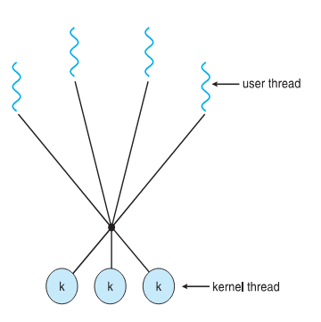

- Aplikasi bebas untuk membuat banyak user threads.
- Kernel mengelola kumpulan kernel thread yang tersedia.
- Aplikasi memetakan beberapa user thread ke kernel thread tertentu.
- Kernel menjadwalkan kernel thread, dan aplikasi menjadwalkan user thread yang dipetakan ke kernel thread tersebut.

### Two-level Model

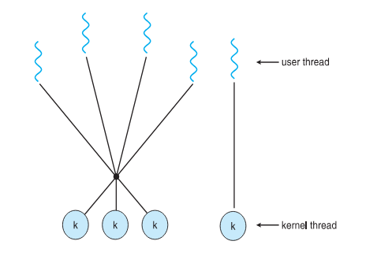

Model ini mirip dengan model threading M:M (Banyak-ke-Banyak) di mana beberapa user thread dapat dipetakan ke beberapa kernel thread. Namun, ada fitur tambahan: 
- Pengikatan (Binding): User thread dapat secara eksplisit diikat ke kernel thread tertentu.

- Model ini digunakan di beberapa sistem operasi lawas, termasuk: IRIX, HP-UX, Tru64 UNIX, Solaris

### Thread Libraries
- Threas Library memungkinkan programmer untuk membuat
dan mengelola thread
- Implementasi library threads : 
    1. Library Sepenuhnya di Ruang Pengguna (User Space)
    2. Library Didukung oleh Level Kernel (Kernel Level)

### Pthreads
Pthreads, atau POSIX Threads, adalah singkatan dari POSIX Threads Standard.  Ini adalah kumpulan fungsi (API) yang  disediakan oleh library  untuk membantu programmer membuat dan mengelola thread dalam program  berdasarkan  standar POSIX.  POSIX adalah standar antarmuka pemrograman portabel yang  digunakan oleh banyak sistem operasi seperti Linux, macOS, dan beberapa varian Unix.

- Pthreads dapat diimplementasikan di ruang pengguna (user-level) atau di level kernel (kernel-level). Ini tergantung pada sistem operasi dan library yang digunakan.
- Pthreads menspesifikasikan perilaku dari library thread, bukan cara implementasinya.

### Pthreads Example

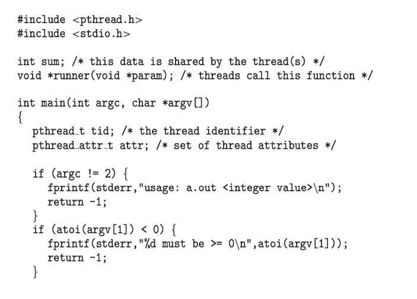

### Pthreads Example (Cont.)

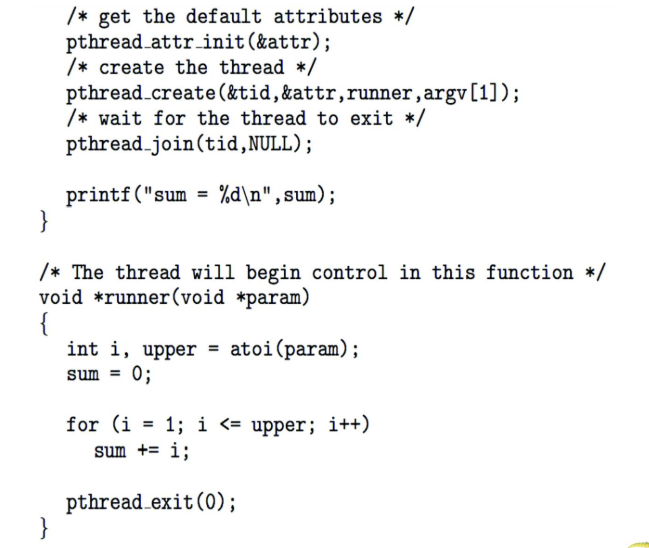

### Pthreads Code for Joining 10 Threads

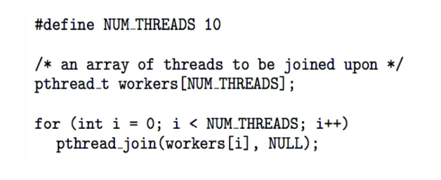

### Windows Multithreaded C Program

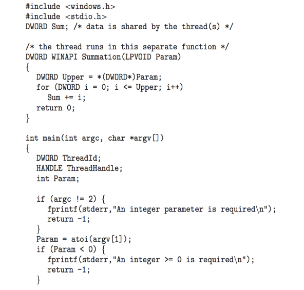

### Windows Multithreaded C Program (Cont.)

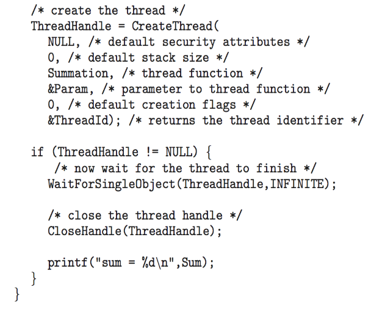

### Java Threads
- Java threads di kelola oleh JVM
-  diimplementasikan menggunakan model thread yang disediakan oleh Sistem Operasi (OS) yang mendasarinya.
- contoh Java Threads : 

    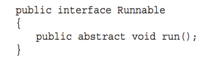
    - mewarisi (extend) kelas bawaan Java yaitu Thread.
    - Mengimplementasikan Interface Runnable

### Java Multithreaded Program

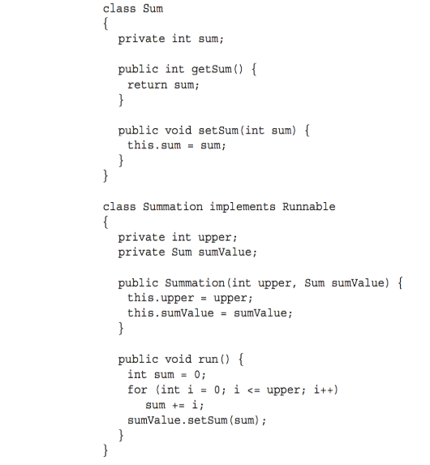

### Java Multithreaded Program (Cont.)

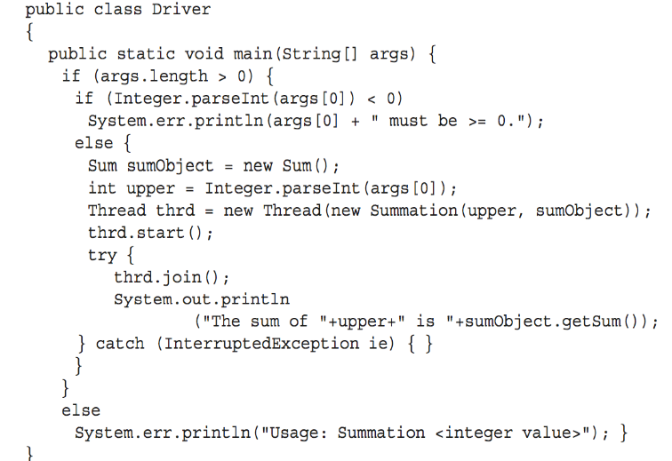

### Implicit Threading
pengelolaan thread dilakukan secara otomatis oleh compiler dan library runtime. 
Tiga metode umum yang digunakan dalam implicit threading adalah:
- Thread Pools : Menggunakan kembali threads yang telah dibuat untuk berbagai tugas, meningkatkan efisiensi dan mengurangi overhead pembuatan thread.
- OpenMP : memparalelkan loop dan bagian kode lainnya dalam program.
- Grand Central Dispatch (GCD) : GCD menawarkan API tingkat tinggi yang memudahkan programmer untuk membuat dan mengelola thread, serta mensinkronisasi akses ke data bersama.

### Threads Pool 
Kumpulan utas (thread pool) adalah sekelompok utas yang menunggu untuk ditugaskan tugas. Hal ini meningkatkan kinerja program dengan menggunakan kembali utas yang sudah ada alih-alih membuat utas baru untuk setiap tugas. Hal ini dapat mengurangi overhead dan meningkatkan stabilitas sistem. Jumlah utas dalam kumpulan dapat disesuaikan berdasarkan beban kerja.

1. Buat sejumlah thread dalam sebuah pool di mana mereka menunggu untuk dikerjakan
2. Keuntungan : 
    - Lebih cepat dalam menangani permintaan karena sudah tersedia threads sebelumnya
    - Jumlah thread dalam aplikasi terikat dengan ukuran pool 
    - Memisahkan tugas yang akan dilakukan dari mekanisme pembuatan tugas memungkinkan strategi yang berbeda untuk menjalankan tugas
Windows API supports thread pools:

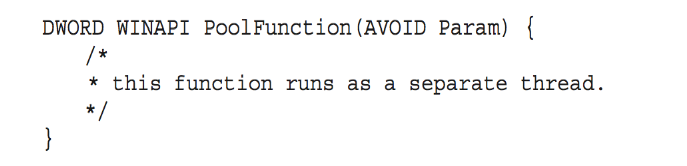

### OpenMP
OpenMP (Open Multi-Processing) adalah antarmuka pemrograman aplikasi (API) yang memungkinkan programmer untuk memanfaatkan kekuatan pemrograman paralel dalam bahasa C, C++, dan Fortran.  OpenMP menyediakan kumpulan arahan kompilator dan fungsi pustaka yang mudah digunakan untuk mendistribusikan tugas di antara beberapa thread, sehingga meningkatkan performa program pada sistem multi-core.

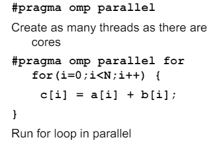

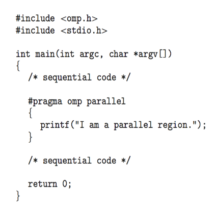

### Grand Central Dispatch
Grand Central Dispatch (GCD) - sebuah teknologi untuk sistem operasi Mac OS X dan iOS Apple - adalah kombinasi ekstensi ke bahasa C, API, dan perpustakaan run-time yang memungkinkan pengembang aplikasi mengidentifikasi bagian kode untuk dijalankan paralel. Seperti OpenMP, GCD mengelola sebagian besar detail threading. GCD mengidentifikasi ekstensi pada bahasa C dan C++ yang dikenal sebagai blok. Sebuah blok hanyalah sebuah unit kerja mandiri. Hal ini ditentukan dengan tanda sisipan ˆ yang disisipkan di depan sepasang kurung kurawal {}.

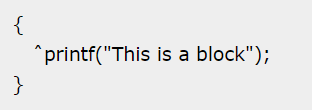

### Threading Issue
Semantics of fork() and exec() system calls
fork() membuat sebuah proses baru yang merupakan salinan dari proses yang dipanggil. Ini termasuk menyalin semua thread dalam sebuah program multi-threaded pada beberapa sistem UNIX. Ada dua versi fork() yang mengontrol berapa banyak thread yang disalin. fork dapat menduplikasi semua thread dari proses induk ke proses anak atau hanya thread yang dipanggil oleh proses induk.

exec() menggantikan seluruh proses dengan program baru yang ditentukan dalam argumen-argumennya.

Karena exec() menggantikan proses, maka tidak perlu melakukan fork() dan menyalin semua thread jika exec() dipanggil setelahnya. Dalam kasus ini, versi fork() yang hanya menyalin thread yang dipanggil akan lebih efisien.

Signal Handling
Sinyal adalah interupsi perangkat lunak yang dikirimkan ke suatu proses. Sistem operasi menggunakan sinyal untuk melaporkan situasi luar biasa ke program yang sedang dijalankan. Beberapa sinyal melaporkan kesalahan seperti referensi ke alamat memori yang tidak valid; yang lain melaporkan peristiwa yang tidak sinkron, seperti terputusnya saluran telepon.

Sebuah pengelola sinyal digunakan untuk memproses sinyal

Sinyal dihasilkan oleh suatu peristiwa tertentu
Sinyal dikirimkan ke sebuah proses
Sinyal ditangani oleh salah satu dari dua penangan sinyal:
default
ditentukan pengguna
Setiap sinyal memiliki penanganan default yang dijalankan kernel saat menangani sinyal

Penanganan sinyal yang ditentukan pengguna dapat menggantikan default
Untuk single-threaded, sinyal dikirim ke proses
Ke mana sinyal harus dikirimkan untuk multi-threaded?

Mengirimkan sinyal ke utas yang menggunakan sinyal tersebut
Mengirimkan sinyal ke setiap utas dalam proses
Mengirimkan sinyal ke utas tertentu dalam proses
Menetapkan thread tertentu untuk menerima semua sinyal untuk proses
Dalam program multithreaded, sinyal dapat menjadi rumit. Tidak seperti single-threaded apps di mana sinyal menuju ke seluruh proses, multithreading membuat target menjadi tidak jelas.

Ada dua jenis sinyal:

Synchronous: Dikirim ke thread yang menyebabkannya (seperti kesalahan program).
Asynchronous: Dapat datang secara tidak terduga dari luar program (seperti sinyal penghentian).
Sinyal Asynchronous merupakan tantangan dalam multithreading karena tidak jelas thread mana yang harus menerimanya. Pada sistem Unix, thread dapat menentukan sinyal mana yang mereka inginkan, tetapi OS pada akhirnya memutuskan pengirimannya.
Windows menggunakan Panggilan Prosedur Asinkron (APC) sebagai pengganti sinyal. Tidak seperti Unix di mana sebuah thread memilih sinyalnya, semua thread dalam proses Windows dapat menerima APC.
Thread Cancellation
Menghentikan thread sebelum selesai dikerjakan Thread yang akan dibatalkan adalah thread target Dua pendekatan umum:

Pembatalan asynchronous menghentikan thread target dengan segera
Deffered cancellation memungkinkan thread target untuk secara berkala memeriksa apakah harus dibatalkan
App Screenshot

Pembatalan utas memungkinkan Anda menghentikan thread sebelum menyelesaikan tugasnya. Ada dua jenis utama:

Asynchronous cancellation: Pembatalan secara tiba-tiba menghentikan thread target tanpa memperhatikan statusnya, yang dapat menyebabkan masalah seperti kebocoran sumber daya atau data yang rusak jika thread tersebut memperbarui informasi bersama.
Deffered cancellation: **Ini memberikan kesempatan kepada thread target untuk membersihkan diri dan keluar dengan tenang. Thread memeriksa bendera pembatalan secara berkala untuk melihat apakah thread tersebut harus berhenti. Titik pembatalan adalah saat-saat tertentu dalam kode thread di mana pembatalan aman karena thread tidak berada di tengah-tengah operasi yang kritis.
Thread-Local Storage
Thread Local Storage (TLS) adalah metode di mana setiap thread dalam proses multithreaded dapat mengalokasikan lokasi untuk menyimpan data spesifik thread. Data spesifik thread yang terikat secara dinamis (run-time) didukung melalui API TLS (TlsAlloc).

thread-local storage (TLS) memungkinkan setiap thread memiliki salinan datanya sendiri
Berguna ketika Anda tidak memiliki kendali atas proses pembuatan thread (misalnya, ketika menggunakan kumpulan thread)
Berbeda dengan variabel lokal
Variabel lokal hanya terlihat selama pemanggilan fungsi tunggal
TLS terlihat di seluruh pemanggilan fungsi
Mirip dengan data statis
TLS bersifat unik untuk setiap thread
Scheduler Activations
Baik model M:M dan two-level model memerlukan komunikasi untuk mempertahankan jumlah thread kernel yang sesuai yang dialokasikan ke aplikasi

Biasanya menggunakan struktur data perantara antara thread pengguna dan kernel - lightweight process (LWP)

Tampak sebagai prosesor virtual di mana proses dapat menjadwalkan thread pengguna untuk dijalankan
Setiap LWP dilampirkan ke thread kernel
Berapa banyak LWP yang harus dibuat?
Aktivasi penjadwal menyediakan upcalls - mekanisme komunikasi dari kernel ke upcall handler di pustaka thread

Komunikasi ini memungkinkan aplikasi untuk mempertahankan jumlah thread kernel yang benar

References
https://www.geeksforgeeks.org/threading-issues/
https://en.wikipedia.org/wiki/Thread-local_storage
https://learn.microsoft.com/en-us/cpp/parallel/thread-local-storage-tls?view=msvc-170
Windows Threads
Windows mengimplementasikan API Windows - primary API untuk Win 98, Win NT, Win 2000, Win XP, dan Win 7
Mengimplementasikan one-to-one mapping, tingkat kernel
Setiap threads berisi
Sebuah id thread
Set register yang mewakili status processor
Tumpukan pengguna dan kernel yang terpisah ketika thread berjalan dalam mode pengguna atau mode kernel
Area penyimpanan data pribadi yang digunakan oleh pustaka run-time dan pustaka tautan dinamis (DLL)
Kumpulan register, tumpukan, dan area penyimpanan pribadi dikenal sebagai konteks dari thread
Struktur data utama dari sebuah thread meliputi:
ETHREAD (blok thread eksekutif) - termasuk pointer ke proses yang mana thread tersebut berada dan ke KTHREAD, di ruang kernel
KTHREAD (blok thread kernel) - scheduling dan synchronization info, tumpukan kernel-mode, pointer ke TEB, dalam ruang kernel
TEB (blok lingkungan thread) - id thread, tumpukan mode-pengguna, penyimpanan thread-lokal, di ruang pengguna
No 1
Berikan tiga contoh pemrograman di mana multithreading memberikan kinerja yang lebih baik daripada solusi single-threaded.

Jawaban:

Sebuah server Web yang melayani setiap permintaan dalam thread yang berbeda.
Aplikasi yang diparalelkan seperti perkalian matriks di mana bagian-bagian yang berbeda dari matriks dapat dikerjakan secara paralel.
Sebuah program GUI interaktif seperti debugger di mana sebuah thread digunakan untuk memantau masukan pengguna, thread lain mewakili aplikasi yang berjalan, dan thread ketiga memantau kinerja.
Penjelasan
a. Web Server:

Dalam kasus web server, masing-masing permintaan dari klien (seperti mengambil halaman web atau data dari server) dapat dianggap sebagai tugas yang independen. Dengan menggunakan multithreading, server dapat menangani beberapa permintaan secara bersamaan. Sebagai contoh, ketika satu thread sedang menunggu respon dari database, thread lainnya dapat melayani permintaan dari klien lainnya. Ini dapat mengoptimalkan penggunaan sumber daya server dan meningkatkan responsivitas secara keseluruhan.

b. Parallelized Application (Aplikasi Paralel):

Dalam kasus seperti perkalian matriks, ada banyak operasi yang dapat dijalankan secara independen. Dengan menggunakan multithreading, bagian-bagian dari matriks dapat dikalikan secara bersamaan oleh thread yang berbeda. Ini memungkinkan untuk meningkatkan throughput secara signifikan karena beberapa operasi dapat dilakukan secara paralel tanpa harus menunggu selesainya operasi sebelumnya.

c. Interactive GUI Program (Program Antarmuka Pengguna Grafis yang Interaktif):

Dalam aplikasi seperti debugger, kita mungkin memiliki tugas-tugas yang berjalan secara bersamaan. Satu thread mungkin bertanggung jawab untuk menerima input dari pengguna, yang lain untuk menjalankan aplikasi yang sedang di-debug, dan yang lainnya mungkin untuk memantau kinerja aplikasi. Dengan menggunakan multithreading, aplikasi dapat tetap responsif terhadap input pengguna sementara masih dapat menjalankan tugas-tugas lain secara bersamaan tanpa mengganggu pengalaman pengguna. Ini memungkinkan debugger untuk tetap aktif sambil melakukan pemantauan kinerja dan menjalankan kode yang sedang di-debug secara bersamaan.

References
https://rdr11.it.student.pens.ac.id/Semester2/Sistem Operasi/Teori/TeoriOS7rev1_1D4TIB_2110191044.pdf
No 2
Apa dua perbedaan antara thread tingkat pengguna dan thread tingkat kernel? Dalam keadaan apa satu jenis lebih baik daripada yang lain?

Jawaban:

Thread tingkat pengguna tidak diketahui oleh kernel, sedangkan kernel mengetahui thread tingkat kernel.
Pada sistem yang menggunakan pemetaan M:1 atau M:N, thread pengguna diatur oleh pustaka thread dan kernel mengatur thread kernel.
Thread kernel tidak harus dikaitkan dengan proses sedangkan setiap thread pengguna milik proses. Thread kernel umumnya lebih mahal untuk dipertahankan daripada thread pengguna karena mereka harus diwakili dengan struktur data kernel.
Penjelasan
Perbedaan antara user-level threads dan kernel-level threads terletak pada tingkat di mana sistem operasi terlibat dan bagaimana proses penjadwalan dilakukan. User-level threads tidak dikenal oleh kernel, sementara kernel-level threads dikenal oleh kernel. Selain itu, pada sistem dengan pemetaan M:1 atau M:N, user-level threads dijadwalkan oleh perpustakaan thread, sedangkan kernel-level threads dijadwalkan oleh kernel.

Pilihan antara kedua jenis ini tergantung pada kebutuhan aplikasi. User-level threads memiliki overhead yang lebih rendah karena mereka dikelola sepenuhnya oleh program pengguna tanpa intervensi kernel. Namun, kernel-level threads dapat memberikan kinerja yang lebih baik dan lebih stabil karena mereka dapat dijadwalkan langsung oleh kernel dan memiliki kemampuan untuk menggunakan multiple core. Sebagai aturan umum, user-level threads lebih cocok untuk aplikasi yang membutuhkan manajemen yang sangat ringan, sementara kernel-level threads lebih cocok untuk aplikasi yang memerlukan kinerja dan skalabilitas yang tinggi.

References
https://www.geeksforgeeks.org/difference-between-user-level-thread-and-kernel-level-thread/
https://www.geeksforgeeks.org/thread-in-operating-system/
No 3
Jelaskan tindakan yang diambil oleh kernel untuk context switch antara kernel level threads.

Jawaban:

Peralihan konteks antara benang kernel biasanya memerlukan penyimpanan nilai dari register CPU dari thread yang sedang dipindahkan dan mengembalikan register CPU dari thread baru yang sedang dijadwalkan.

Penjelasan
Saat melakukan context-switch antara thread-thread di level kernel, kernel perlu menyimpan nilai-nilai register CPU dari thread yang akan diganti dan mengembalikan nilai-nilai register CPU dari thread baru yang akan dijadwalkan.

Apa itu Context Swicth
Context-switch adalah proses di mana CPU beralih dari eksekusi satu proses atau thread ke proses atau thread lainnya. Saat melakukan context-switch, sistem operasi menyimpan status (atau konteks) dari proses atau thread yang sedang berjalan saat ini, termasuk nilai-nilai register CPU, pointer instruksi, dan informasi lain yang diperlukan untuk melanjutkan eksekusi nanti. Kemudian, sistem operasi memuat konteks dari proses atau thread baru yang akan dieksekusi sehingga CPU dapat melanjutkan eksekusi dari titik terakhir di mana proses atau thread sebelumnya dihentikan. Context-switch memungkinkan sistem operasi untuk memberikan kesan bahwa banyak proses atau thread sedang berjalan secara bersamaan, meskipun CPU sebenarnya melakukan eksekusi secara bergantian di antara mereka.

References
https://www.geeksforgeeks.org/context-switch-in-operating-system/
No 4
Sumber daya apa saja yang digunakan ketika thread dibuat? Bagaimana perbedaannya dengan yang digunakan ketika proses dibuat?

Jawaban:

Karena thread lebih kecil daripada proses, pembuatan thread biasanya menggunakan sumber daya yang lebih sedikit dibandingkan dengan pembuatan proses. Membuat proses membutuhkan alokasi blok kontrol proses (PCB), struktur data yang cukup besar. PCB mencakup peta memori, daftar file yang dibuka, dan variabel lingkungan. Mengalokasikan dan mengelola peta memori biasanya merupakan aktivitas yang paling memakan waktu. Membuat thread pengguna atau kernel melibatkan alokasi struktur data kecil untuk menampung set register, tumpukan, dan prioritas.

Penjelasan
Ketika membuat sebuah thread, digunakan lebih sedikit sumber daya dibandingkan dengan membuat sebuah proses. Proses memerlukan alokasi blok kontrol proses (PCB), struktur data yang cukup besar, yang mencakup peta memori, daftar file terbuka, dan variabel lingkungan. Pembuatan PCB dan pengelolaan peta memori biasanya memakan waktu paling lama. Sedangkan, pembuatan sebuah thread melibatkan alokasi struktur data kecil untuk menampung set register, tumpukan, dan prioritas.

References
https://www.guru99.com/difference-between-process-and-thread.html?gpp&gpp_sid
No 5
Asumsikan bahwa sistem operasi memetakan thread tingkat pengguna ke kernel menggunakan model many-to-many dan bahwa pemetaan dilakukan melalui LWPs. Selain itu, sistem memungkinkan pengembang untuk membuat thread real-time untuk digunakan dalam sistem real-time. Apakah perlu mengikat thread real-time ke LWP? Jelaskan.

Jawaban:

Ya. Waktu sangat krusial untuk aplikasi real-time. Jika thread ditandai sebagai real-time tetapi tidak terikat ke LWP, thread mungkin harus menunggu untuk dihubungkan ke LWP sebelum berjalan. Pertimbangkan jika thread real-time sedang berjalan (terhubung ke LWP) dan kemudian melanjutkan untuk memblokir (mis. harus melakukan I/O, telah dipraemptif oleh thread real-time prioritas lebih tinggi, sedang menunggu kunci penguncian mutual, dll.) Sementara thread real-time diblokir, LWP yang sebelumnya terhubung telah ditugaskan ke thread lain. Ketika thread real-time telah dijadwalkan untuk berjalan lagi, ia harus menunggu untuk dihubungkan ke LWP. Dengan mengikat LWP ke thread real-time, Anda memastikan thread akan dapat berjalan dengan penundaan minimal setelah dijadwalkan.

Penjelasan
Tentu! Saat menggunakan thread real-time dalam sistem, penting untuk mengikatnya ke dalam unit pemrosesan yang disebut LWP. Tanpa ikatan ini, thread real-time mungkin harus menunggu sebelum bisa berjalan. Ini bisa menyebabkan penundaan yang tidak diinginkan dalam kinerja aplikasi yang membutuhkan waktu respons cepat. Dengan mengikat thread real-time ke LWP, kita memastikan bahwa thread tersebut bisa langsung berjalan begitu dijadwalkan tanpa penundaan tambahan.

Apa itu LWP?
LWP singkatan dari "Lightweight Process" atau Proses Ringan. Ini adalah unit pemrosesan kecil yang dikelola oleh sistem operasi untuk mengeksekusi thread. Dalam sistem operasi yang menggunakan model many-to-many untuk memetakan thread pengguna ke kernel, seperti Solaris dan beberapa versi UNIX lainnya, LWP berfungsi sebagai perantara antara thread pengguna dan kernel. Mereka membantu dalam penjadwalan dan pengelolaan sumber daya untuk thread, memungkinkan sistem operasi untuk mengelola thread secara efisien. Dalam konteks ini, mengikat thread real-time ke LWP berarti menghubungkan thread tersebut ke unit pemrosesan yang akan mengeksekusinya.

References
https://www.geeksforgeeks.org/thread-scheduling/
References
https://socs.binus.ac.id/2020/12/13/thread-unit-pemanfaatan-cpu/
https://rdr11.it.student.pens.ac.id/Semester2/Sistem Operasi/Teori/TeoriOS7rev1_1D4TIB_2110191044.pdf
https://www.geeksforgeeks.org/context-switch-in-operating-system/