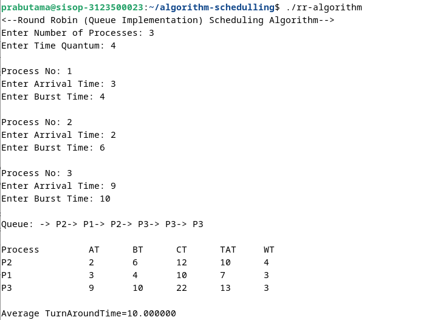

  <h2 style="text-align: center;font-weight: bold">Praktikum 11
Praktek Sistem Operasi </h2>
  <h4 style="text-align: center;">Dosen Pengampu : Dr. Ferry Astika Saputra, S.T., M.Sc.</h4>

 

  
  <h3 style="text-align: center;">Disusun Oleh :  Kelompok 7</h3>
  

    <strong>Achmad Risel Araby (3123500025)</strong> 
    <strong>Danur Isa Prabutama (3123500023)</strong> 
    <strong>Fikri Athanabil Efendi (3123500012)</strong>

  

<h3 style="text-align: center;line-height: 1.5">Politeknik Elektronika Negeri Surabaya Departemen Teknik Informatika Dan Komputer Program Studi Teknik Informatika 2024/2025</h3>
  

## Schedulling Algorithm
### First-Come First-Serve Algorithm
#### Perhitungan Proses secara Teori

#### Perhitungan Proses secara Teori

#### Flowchart dari First-Come First-Serve Algorithm

### Analisa
Algoritma penjadwalan FCFS adalah seperti sistem antrian linier. Proses yang pertama kali meminta layanan akan diproses terlebih dahulu, mirip dengan antrian di bank tempat orang yang datang pertama kali dilayani terlebih dahulu.
FCFS unggul dalam kesederhanaan dan keadilan. Namun, jika antriannya panjang dan proses yang dilayani memiliki durasi yang tidak merata, maka FCFS bisa menjadi kurang efisien.
Oleh karena itu, FCFS paling sesuai untuk skenario di mana proses yang ditangani umumnya berdurasi singkat dan urutan pengerjaan tidak terlalu menjadi prioritas. Contohnya termasuk antrian untuk layanan publik dengan tingkat kepentingan yang sama, atau pencetakan dokumen di kantor kecil.

___

### Shorted Job  Algorithm
#### Perhitungan Proses secara Teori

#### Hasil percobaan running program

#### Flowchart dari Shorted Job Algorithm

#### Analisa
Shorted Job First(SJF) adalah algoritma penjadwalan yang efektif untuk meminimalkan waktu tunggu rata-rata dan meningkatkan kinerja sistem, terutama ketika terdapat proses dengan burst time yang tidak merata. Namun, SJF memerlukan prediksi burst time yang akurat dan memiliki overhead yang lebih tinggi dibandingkan algoritma lain.  Jika ada kondisi dimana suatu proses memiliki burst time yang sama, maka yang didahulukan adalah proses yang arrival timenya lebih kecil (yang datang lebih dulu). Algoritma ini cocok untuk situasi di mana waktu tunggu rata-rata dan responsivitas sistem menjadi prioritas utama, dan prioritas proses tidak menjadi pertimbangan utama. 

___

### Round Robin Algorithm
#### Perhitungan Proses secara Teori

#### Hasil percobaan running program

#### Flowchart dari Round Robin Algorithm

#### Analisa 
Round Robin adalah algoritma penjadwalan yang fleksibel dan dapat dikonfigurasi untuk menangani beberapa proses. Dengan pemilihan quantum time yang tepat, pertimbangan prioritas yang terintegrasi, dan pemantauan kinerja yang berkelanjutan, RR dapat menjadi solusi yang efektif untuk berbagai skenario penjadwalan, terutama di mana terdapat banyak proses interaktif dengan burst time yang serupa dan prioritas yang tidak terlalu bervariasi. Prioritas proses juga dapat dipertimbangkan dalam Round Robin, meskipun fokus utamanya adalah kesetaraan. Algoritma hybrid yang menggabungkan RR dengan skema penjadwalan berbasis prioritas, seperti Priority Round Robin (PRR), memungkinkan proses dengan prioritas tinggi mendapatkan quantum time yang lebih lama.
