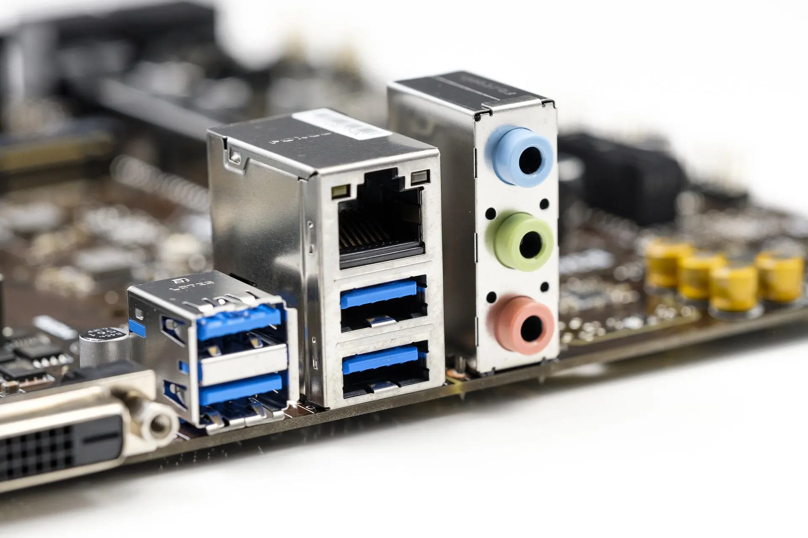

  <h2 style="text-align: center;font-weight: bold">LAPORAN PRAKTIKUM 2 SISTEM OPERASI </h2>
  <h4 style="text-align: center;">Dosen Pengampu : Dr. Ferry Astika Saputra, S.T., M.Sc.</h4>

 

  
  <h3 style="text-align: center;">Disusun Oleh :  Kelompok 7</h3>
  

    <strong>Achmad Risel Araby (3123500025)</strong> 
    <strong>Danur Isa Prabutama (3123500023)</strong> 
    <strong>Fikri Athanabil Efendi (3123500012)</strong>

  

<h3 style="text-align: center;line-height: 1.5">Politeknik Elektronika Negeri Surabaya Departemen Teknik Informatika Dan Komputer Program Studi Teknik Informatika 2024/2025</h3>
  

## Perbedaan Legacy(BIOS) dan UEFI
Sebelum kita masuk pada penjelasan mengenai langkah langkah proses booting pada komputer, kita pelajari terlebih dahulu tentang perbedaan BIOS dan UEFI
### Apa itu BIOS?

BIOS adalah kependekan dari Sistem Input/Output Dasar. Ini adalah antarmuka firmware mendasar yang ditemukan di komputer. Selama proses booting, ia bertanggung jawab untuk menginisialisasi komponen perangkat keras, seperti prosesor, memori, dan perangkat penyimpanan. BIOS menyediakan instruksi yang diperlukan komputer untuk memulai dan memuat sistem operasi.

BIOS telah ada selama beberapa dekade. Inilah salah satu alasan mengapa bios bekerja dengan lancar di perangkat lama. Perbedaan utama antara UEFI dan BIOS terletak pada arsitektur dan kemampuannya. Meskipun BIOS menggunakan mode 16-bit dan memiliki antarmuka pengguna terbatas, UEFI menggunakan mode 32-bit atau 64-bit dan menawarkan antarmuka pengguna grafis yang lebih canggih.

### Apa itu UEFI?

UEFI (Unified Extensible Firmware Interface) adalah antarmuka firmware modern yang menggantikan BIOS lama di komputer. Ini menjembatani kesenjangan antara perangkat keras komputer dan sistem operasi, memungkinkan kompatibilitas, keamanan, dan fungsionalitas yang lebih baik.

Dibandingkan BIOS, UEFI menawarkan beberapa keunggulan. UEFI mendukung hard drive yang lebih besar dan dapat menangani partisi yang lebih besar dari 2,2 terabyte, sedangkan BIOS memiliki keterbatasan dalam hal ini. Ini juga mendukung antarmuka pengguna yang lebih modern dan grafis, membuat navigasi dan konfigurasi pengaturan sistem menjadi lebih mudah.

### BIOS vs UEFI: Tanggal Rilis
####  BIOS 
Tonggak penting dalam pengembangan firmware komputer adalah diperkenalkannya BIOS dan UEFI, dua antarmuka sistem berbeda yang merevolusi cara sistem operasi berinteraksi dengan perangkat keras.
BIOS adalah antarmuka firmware asli yang digunakan di komputer. Ini telah digunakan sejak tanggal peluncurannya, 1981 , dan tetap menjadi standar selama bertahun-tahun.

#### UEFI
UEFI jauh lebih baru dibandingkan dengan BIOS. Intel mengembangkannya dengan spesifikasi pertama yang dirilis pada tahun 2002 untuk menggantikan arsitektur BIOS.
UEFI dirancang untuk mengatasi banyak keterbatasan BIOS, khususnya mengenai kompatibilitas perangkat keras dan antarmuka perangkat lunak.

### BIOS vs UEFI: Antarmuka Pengguna
#### BIOS
BIOS memiliki antarmuka berbasis teks yang dapat dinavigasi menggunakan perintah keyboard. Ini beroperasi dalam mode BIOS lama dan telah menjadi antarmuka firmware standar selama beberapa dekade.
Meskipun BIOS memenuhi tujuannya dengan baik, UEFI menawarkan beberapa keunggulan dibandingkan BIOS. Keunggulan ini mencakup antarmuka pengguna grafis, dukungan untuk perangkat penyimpanan yang lebih luas, waktu booting lebih cepat, dan fitur keamanan yang ditingkatkan.

#### UEFI
Sebaliknya, UEFI menawarkan antarmuka pengguna grafis (GUI) yang dikontrol dengan mouse atau touchpad. Ini berarti UEFI lebih ramah pengguna dan lebih mudah dinavigasi.
Keunggulan ini menjadikan peralihan dari BIOS ke UEFI menjadi pilihan yang diinginkan banyak pengguna.

### BIOS vs UEFI: Mode Pengoperasian
Dalam perbandingan antara BIOS dan UEFI, salah satu perbedaan utama terletak pada mode pengoperasiannya.

#### BIOS
BIOS adalah antarmuka firmware tradisional yang ditemukan pada sistem lama. Ini beroperasi dalam mode BIOS lama dengan batasan tertentu, seperti mode prosesor 16-bit dan dukungan hard drive maksimum 2,2 TB.

#### UEFI
Sebaliknya, UEFI menyediakan antarmuka yang lebih canggih dan modern dengan dukungan hard drive yang lebih besar, waktu booting yang lebih cepat, dan fitur keamanan yang lebih baik.
Tidak seperti BIOS, UEFI mendukung perangkat penyimpanan yang lebih besar dan dapat menangani lebih banyak partisi, yang sangat penting untuk kebutuhan komputasi modern. Ini menampilkan antarmuka pengguna grafis (GUI), meningkatkan pengalaman pengguna dengan membuat navigasi dan konfigurasi lebih intuitif. 
UEFI juga menghadirkan fitur-fitur yang lebih canggih daripada BIOS, seperti booting jaringan dan diagnostik jarak jauh, sehingga meningkatkan fungsionalitas dan kemampuan beradaptasi dalam beragam lingkungan komputasi.

### BIOS vs UEFI: Dukungan Partisi
#### BIOS
BIOS, antarmuka firmware lama, memiliki kemampuan dukungan partisi terbatas. Itu hanya dapat melakukan booting dari partisi MBR ( Master Boot Record ) dan dibatasi oleh batas ukuran disk maksimum, tidak dapat melakukan booting dari disk yang lebih besar dari 2,2TB.
Sistem BIOS dibatasi pada empat partisi utama dan tidak mendukung fitur lanjutan seperti Secure Boot.

#### UEFI
UEFI menawarkan dukungan partisi yang ditingkatkan secara signifikan. Tidak seperti BIOS, UEFI dapat melakukan booting dari partisi MBR dan GPT (GUID Partition Table). Fleksibilitas ini memungkinkannya mendukung disk yang jauh lebih besar, mengatasi batasan BIOS sebesar 2,2 TB.
UEFI tidak membatasi jumlah partisi primer menjadi empat, sehingga memungkinkan pengaturan partisi yang lebih kompleks. 

### BIOS vs. UEFI: Keamanan
#### BIOS
BIOS menawarkan langkah-langkah keamanan dasar. Akses ke pengaturan BIOS biasanya melalui layar pengaturan BIOS, yang dapat dimasukkan menggunakan kombinasi tombol tertentu selama proses booting.  
Namun, sistem BIOS lama tidak memiliki fitur keamanan modern, sehingga lebih rentan terhadap malware dan akses tidak sah. Meskipun kata sandi BIOS memberikan tingkat keamanan dasar, kata sandi tersebut sering kali dapat dengan mudah dilewati.  
Memperbarui firmware BIOS dapat meningkatkan keamanan dengan memperbaiki kerentanan dan memperkenalkan fitur-fitur baru, namun masih belum memenuhi standar keamanan saat ini.

#### UEFI
UEFI memberikan fitur keamanan yang ditingkatkan dibandingkan dengan BIOS. Ini mendukung boot aman, yang memastikan bahwa hanya sistem operasi dan firmware resmi yang dimuat selama proses booting.
Ini juga mencakup metode yang lebih aman untuk menangani master boot record. Peningkatan keamanan ini menjadikan UEFI pilihan yang lebih aman dibandingkan dengan BIOS.

### BIOS vs. UEFI: Performa
#### BIOS
BIOS telah menjadi standar selama bertahun-tahun tetapi tidak memiliki beberapa fitur lanjutan yang ditemukan di UEFI. Kinerjanya secara umum memadai untuk tugas-tugas dasar tetapi kurang dalam beberapa hal dibandingkan dengan UEFI. 
Misalnya, BIOS tidak menawarkan kecepatan waktu boot yang sama seperti UEFI. 
Ia juga memiliki keterbatasan dalam menangani hard drive yang lebih besar dan partisi yang lebih banyak, yang dapat menjadi kendala dalam lingkungan komputasi modern.

#### UEFI
UEFI mendukung fitur-fitur lebih canggih yang tidak ada dalam sistem BIOS tradisional. 
Ini termasuk booting aman, yang melindungi sistem terhadap malware dan perangkat lunak tidak sah, dan booting jaringan, yang memungkinkan diagnostik dan manajemen jarak jauh. 
Kombinasi fitur ini menjadikan UEFI pilihan yang lebih serbaguna dan tangguh untuk kebutuhan komputasi kontemporer, terutama di lingkungan yang mengutamakan kinerja dan keamanan.

### Kesimpulan
Saat mempertimbangkan perbedaan antara UEFI dan BIOS, terlihat jelas bahwa pilihan keduanya bergantung pada kebutuhan dan prioritas spesifik pengguna.
UEFI menawarkan beberapa keunggulan dibandingkan BIOS tradisional. Karena UEFI lebih baru, ia menyediakan antarmuka yang lebih modern dan fleksibel, mendukung menu grafis dan input mouse. UEFI juga mendukung perangkat penyimpanan yang lebih besar dan memungkinkan waktu booting lebih cepat karena kodenya yang dioptimalkan.  
BIOS telah menjadi standar selama bertahun-tahun dan masih digunakan secara luas. Ia menawarkan kesederhanaan dan kompatibilitas dengan perangkat keras dan sistem operasi lama. BIOS juga memiliki basis pengguna yang sudah lama ada dan dokumentasi ekstensif yang tersedia, sehingga memudahkan pengguna untuk memecahkan masalah dan menyelesaikan masalah.
Meskipun UEFI memiliki banyak keunggulan, UEFI mungkin tidak diperlukan untuk semua pengguna, terutama mereka yang memiliki sistem lama. Namun, seiring berkembangnya teknologi, UEFI diperkirakan akan sepenuhnya menggantikan BIOS, artinya PC dengan UEFI akan menjadi antarmuka firmware standar.

### Sebutkan dan Jelaskan Komponen Motherboard!

## Apa itu Motherboard?

Komputer adalah perangkat elektronik yang memproses data sesuai dengan kebutuhan pengguna menggunakan perangkat IO. Pemrosesan data terjadi di dalam prosesor, sebuah komponen penting. Prosesor terletak di papan sirkuit perangkat keras yang disebut motherboard atau papan sirkuit tercetak (PCB).

### Komponen Motherboard :

1. Slot CPU: Slot ini berfungsi sebagai penghubung antara motherboard dan mikroprosesor. Slot ini membuat CPU lebih mudah dioperasikan dan melindungi CPU dari bahaya saat memasang atau melepasnya. Slot ini juga memiliki kunci untuk menghentikan pergerakan CPU dan pendingin untuk menghilangkan panas tambahan.

   
2. RAM Slot : RAM (Random Access Memory) dipasang di slot atau soket memori pada motherboard. Komputer mungkin memiliki dua slot memori atau lebih.

   
3. Expansion Slot : Sering disebut sebagai port ekstensi atau slot bus. Ini adalah koneksi atau port pada motherboard yang menawarkan tempat untuk meletakkan kartu ekspansi untuk komponen. Slot ini juga dikenal dengan nama slot bus dan port ekspansi. Ini adalah port atau koneksi pada motherboard yang menawarkan tempat untuk menambahkan kartu ekspansi perangkat keras. Misalnya, Anda dapat membeli kartu ekspansi video, menaruhnya di slot ekspansi, dan kemudian memasang kartu video baru di komputer. AGP, AMR, CNR, PCI, dan slot ekspansi populer lainnya di komputer hanyalah beberapa contoh.

   
4. Capacitor : Dua pelat konduksi dan isolator tipis ditempatkan bersama untuk membentuk kapasitor. Komponen-komponen ini terkandung dalam kantong plastik.

   
5. Inductor (Coil) : Kawat penghantar dililitkan di sekitar inti besi untuk membuat kumparan elektromagnetik yang dikenal sebagai induktor. Induktor menyimpan energi magnetik dengan berfungsi sebagai elektromagnet atau induktor.

   
6. Northbridge: Chip terintegrasi yang disebut northbridge memungkinkan komunikasi antara antarmuka CPU, AGP, dan memori. Selain itu, chip ini memungkinkan komunikasi antara chip southbridge dan pengontrol grafis, CPU, dan RAM.

   
7. Southbridge: Mengontrol fungsi input dan output. Karena lokasinya, ini disebut sebagai southbridge. ini memungkinkan komunikasi antara chip northbridge.

   
8. USB Port : Tempat memasang perangkat keras seperti mouse dan keyboard ke komputer menggunakan port USB.

   
9. PCI Slot : Slot ini memungkinkan Anda menyambungkan perangkat keras Peripheral Component Interconnect Slot (PCI), seperti kartu suara dan video, perangkat keras jaringan, dan modem. Slot ini digunakan untuk menyambungkan periferal.

   
10. AGP Slot : Disebut sebagai slot Accelerated Graphics Port (AGP). Slot untuk menyambungkan kartu grafis disediakan. Slot ini digunakan untuk menampilkan grafik pada layar.

    
11. Heat Sink : Panas yang dihasilkan oleh prosesor komputer diserap dan disebarkan oleh heat sink. Fungsi utamanya adalah mendinginkan CPU dengan menyerap panas saat sistem berjalan.

    
12. Power Connector : Tujuan konektor daya adalah untuk memberikan daya ke motherboard.

    
13. CMOS Battery : Semikonduktor Oksida Logam Pelengkap adalah singkatan dari Baterai CMOS. Ini adalah memori penyimpanan. Baterai yang menyediakan daya cadangan.

    
14. Integrated Circuits (IC) : IC juga merupakan komponen yang sangat penting dari motherboard. Sirkuit terpadu digunakan untuk pemrosesan dan penyimpanan data.

    