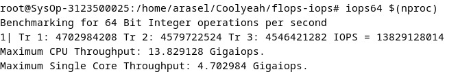
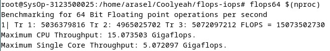
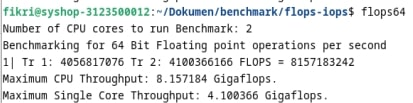

  <h2 style="text-align: center;font-weight: bold">LAPORAN PRAKTIKUM 3 SISTEM OPERASI </h2>
  <h4 style="text-align: center;">Dosen Pengampu : Dr. Ferry Astika Saputra, S.T., M.Sc.</h4>

 

  
  <h3 style="text-align: center;">Disusun Oleh :  Kelompok 7</h3>
  

    <strong>Achmad Risel Araby (3123500025)</strong> 
    <strong>Danur Isa Prabutama (3123500023)</strong> 
    <strong>Fikri Athanabil Efendi (3123500012)</strong>

  

<h3 style="text-align: center;line-height: 1.5">Politeknik Elektronika Negeri Surabaya Departemen Teknik Informatika Dan Komputer Program Studi Teknik Informatika 2024/2025</h3>
  

## Siklus CPU (Fetch, Decode, Execute)

Siklus CPU adalah proses berulang yang dilakukan CPU untuk menjalankan program. Proses ini ibarat jantung komputer, terus berdetak dan memungkinkan komputer untuk bekerja.Kami telah membuat slide penjelasan tentang siklus CPU yang bisa diakses pada link di bawah:

https://intip.in/SIKLUSCPU7

## Pengujian Kemampuan Komputer Dengan Benchmark

Pada praktikum kali ini kami melakukan tugas pengujian kemampuan komputer melalui benchmarking test.Kami melakukan pengujian pada virtual mechine sistem operasi debian 12 dengan jumlah thread yang berbeda. Kami akan melakukan pengujian sebanyak 5 kali baik dengan iops atau flops dan akan mencatat hasil dari pengujian tersebut. Berikut hasil pengujian yang telah kami lakukan.

## Danur Isa Prabutama

Pada Pengujian kali ini komputer hanya menggunakan 1 thread

### Pengujian menggunakan perintah iops64 untuk melakukan perhitungan bilangan integer

### Pengujian 1 :

### Pengujian 2 :

### Pengujian 3 :

### Pengujian 4 :

### Pengujian 5 :

### Pengujian menggunakan perintah flops64 untuk melakukan perhitungan bilangan float

### Pengujian 1 :

### Pengujian 2 :

### Pengujian 3 :

### Pengujian 4 :

### Pengujian 5 :

## Achmad Risel Araby

Pada Pengujian kali ini komputer hanya menggunakan 3 thread

### Pengujian menggunakan perintah iops64 untuk melakukan perhitungan bilangan integer

### Pengujian 1 :

### Pengujian 2 :

### Pengujian 3 :

### Pengujian 4 :

### Pengujian 5 :

### Pengujian menggunakan perintah flops64 untuk melakukan perhitungan bilangan float

### Pengujian 1 :

### Pengujian 2 :

### Pengujian 3 :

### Pengujian 4 :

### Pengujian 5 :

## Fikri Athanbil Efendi

Pada Pengujian kali ini komputer hanya menggunakan 2 thread

### Pengujian menggunakan perintah iops64 untuk melakukan perhitungan bilangan integer

### Pengujian 1 :

### Pengujian 2 :

### Pengujian 3 :

### Pengujian 4 :

### Pengujian 5 :

### Pengujian menggunakan perintah flops64 untuk melakukan perhitungan bilangan float

### Pengujian 1 :

### Pengujian 2 :

### Pengujian 3 :

### Pengujian 4 :

### Pengujian 5 :

## Tabel Perbandingan pengujian

Setelah melakukan beberapa pengujian pada masing masing komputer dengan jumlah thread yang berbeda, kami menyediakan tabel perbandingan pengujian yang tertera di bawah ini.

| Nama       | Thread       | Max Iops       | Max Flps       |
|---------------|---------------|---------------|---------------|
| Danur Isa Prabutana   | 1     | 5.485198  | 7.21145   |
| Achmad Risel Araby    | 3     | 14.079893 | 15.226595 |
| Fikri Athanbil Efendy | 2     | 7.721513  | 8.278674  |

## Analisa

Dari pengujian yang telah kami lakukan menggunakan komputer dari masing masing anggota kelompok dengan jumlah thread yang berbeda dimana komputer Isa memiliki 1 thread, Achmad memiliki 3 thread, dan Fikri memiliki 2 thread. Hasinya menunjukkan bahwa komputer dengan jumlah thread paling banyak yaitu komputer milik achmad, memiliki Maximum CPU Throughput tertinggi. Jadi semakin banyak thread pada suatu komputer maka perhitungannya akan semakin cepat.

## Proses Instalasi GCC, Make, Git
### Instalasi GCC

### Instalasi Make 

### Instalasi Git

## Kesimpulan

IOPS : Pengujian dengan iops adalah menguji komputer untuk melakukan perhitungan bilangan integer dengan waktu tertentu

FlOPS : Pengujian dengan iops adalah menguji komputer untuk melakukan perhitungan bilangan float dengan waktu tertentu

Benchmarking adalah proses pengujian kemampuan komputer dengan menjalankan serangkaian program standar dan mengukur hasilnya. Pengujian ini memberikan banyak manfaat bagi pengguna komputer, di antaranya:

Membandingkan Performa: Benchmarking memungkinkan pengguna untuk membandingkan performa komputer dengan spesifikasi berbeda. Hal ini membantu pengguna dalam memilih komputer yang tepat sesuai kebutuhan dan anggaran.

Mengevaluasi Kinerja: Benchmarking membantu pengguna dalam mengevaluasi kinerja komputer dari waktu ke waktu. Pengguna dapat memantau apakah kinerja komputer menurun atau stabil setelah penggunaan tertentu.

Mengidentifikasi Kemacetan: Benchmarking dapat membantu mengidentifikasi komponen komputer yang menjadi hambatan performa. Hal ini membantu pengguna dalam melakukan upgrade atau optimasi sistem yang tepat.

Mengukur Dampak Perangkat Lunak: Benchmarking dapat membantu mengukur dampak perangkat lunak terhadap performa komputer. Pengguna dapat melihat apakah suatu software memperlambat atau mempercepat kinerja komputer.
