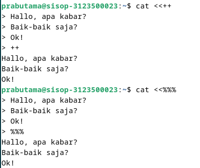
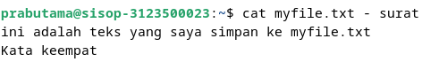
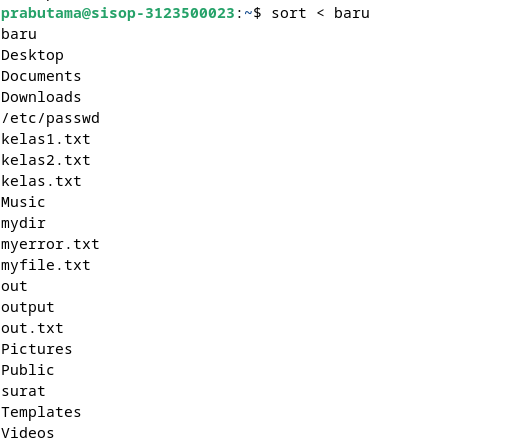
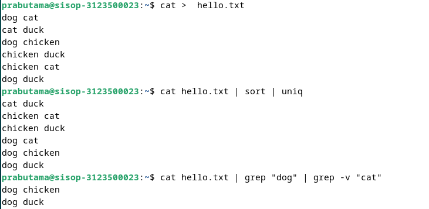

# Operasi Input Output

Referensi : [Shell Programming](https://www.geeksforgeeks.org/introduction-linux-shell-shell-scripting/?ref=shm_)

## POKOK BAHASAN:

```
* Pipeline
* Redirection
```

## TUJUAN PEMBELAJARAN:

Setelah mempelajari materi dalam bab ini, mahasiswa diharapkan mampu:

- Memahami konsep proses I/O dan redirection
- Memahami standar input, output dan error
- Menggunakan notasi output, append dan here document
- Memahami konsep _PIPE_ dan filter

## DASAR TEORI:

### 1. PROSES I/O

Sebuah proses memerlukan Input dan Output. Instruksi (command) yang diberikan pada Linux melalui Shell disebut sebagai eksekusi program yang selanjutnya disebut proses. Setiap kali instruksi diberikan, maka Linux kernel akan menciptakan sebuah proses dengan memberikan nomor PID (Process Identity). Proses dalam Linux selalu membutuhkan Input dan menghasilkan suatu Output.


Dalam konteks Linux input/output adalah :

- Keyboard (input)
- Layar (output)
- Files
- Struktur data kernel
- Peralatan I/O lainnya (misalnya Network)

## 2. FILE DESCRIPTOR

Linux berkomunikasi dengan file melalui file descriptor yang direpresentasikan melalui angka yang dimulai dari 0, 1, 2 dan seterusnya. Tiga buah file descriptor standar yang lalu diciptakan oleh proses adalah :

- 0 = keyboard (standar input)
- 1 = layar (standar output)
- 2 = layar (standar error)

Linux tidak membedakan antara peralatan hardware dan file. Linux memanipulasi peralatan hardware dengan memperlakukannya sama dengan ketika memperlakukan sebuah file.

## 3.PEMBELOKAN (REDIRECTION)

Pembelokan dilakukan untuk standard input, output dan error, yaitu untuk mengalihkan file descriptor dari 0, 1 dan 2. Simbol untuk pembelokan adalah :


## 4. PIPA (PIPELINE)

Mekanisme pipa digunakan sebagai alat komunikasi antar proses.


Proses-1 menghasilkan output yang selanjutnya digunakan sebagai input oleh Proses-2. Hubungan output input ini dinamakan `pipa ataiupipelining`, yang menghubungkan Proses-1 dengan Proses-2 dan dinyatakan dengan symbol “|”.

```
    Proses1 | Proses
```

## 5. FILTER

Filter adalah utilitas Linux yang dapat memproses standard input (dari keyboard) dan menampilkan hasilnya pada standard output (layar). Contoh filter adalah cat, sort, grep, pr, head, tail, paste dan lainnya.
Pada sebuah rangkaian pipa :

        P<sub>1</sub> | P<sub>2</sub> | P<sub>3</sub> ... | P<sub>n-1</sub> | P<sub>n</sub>

Maka P2 sampai dengan P<sub>n-1</sub> berfungsi sebagai filter. P1 (awal) dan Pn (terakhir) boleh tidak filter. Utilitas yang bukan filter misalnya who, ls, ps, lp, lpr, mail dan lainnya.
Beberapa perintah Linux yang digunakan untuk proses penyaringan antara lain :

- Perintah `grep`
  Digunakan untuk menyaring masukannya dan menampilkan baris-baris yang hanya mengandung pola yang ditentukan. Pola ini disebut regular expression.
- Perintah `wc`
  Digunakan untuk menghitung jumlah baris, kata dan karakter dari baris-baris masukan yang diberikan kepadanya. Untuk mengetahui berapa baris gunakan option –l, untuk mengetahui berapa kata, gunakan option –w dan untuk mengetahui berapa karakter, gunakan option –c.
  Jika salah satu option tidak digunakan, maka tampilannya adalah jumlah baris, jumlah kata dan jumlah karakter.
- Perintah `sort`
  Digunakan untuk mengurutkan masukannya berdasarkan urutan nomor ASCII dari karakter.
- Perintah `cut`
  Digunakan untuk mengambil kolom tertentu dari baris-baris masukannya, yang ditentukan pada option –c.
- Perintah `uniq`
  Digunakan untuk menghilangkan baris-baris berurutan yang mengalami duplikasi, biasanya digabungkan dalam pipeline dengan `sort`.

## TUGAS PENDAHULUAN:

## Jawablah pertanyaan-pertanyaan di bawah ini :

#### 1. Apa yang dimaksud redirection?

Redirection adalah pembelokan sebuah output yang dihasilkan dari input yang membantu kita mengarahkan fungsi input dan output ini ke file atau folder yang kita inginkan.Pembelokan ini bisa berguna ketika kita bekerja dengan banyak keluaran atau masukan yang besar karena kita dapat menggunakan data file secara langsung sebagai masukan dan menyimpan hasilnya dalam file.

#### 2. Apa yang dimaksud pipeline?

Pipelining adalah proses menyimpan dan memprioritaskan instruksi komputer yang dijalankan prosesor . Pipeline adalah "pipa logis" yang memungkinkan prosesor melakukan instruksi dalam beberapa langkah. Pemrosesan terjadi secara berkesinambungan, teratur, dan agak tumpang tindih.

#### 3. Apa yang dimaksud perintah di bawah ini :

    echo, cat, more, sort, grep, wc, cut, uniq

echo: menampilkan string atau variabel ke terminal

cat: mencantumkan, menggabungkan, dan menulis konten atau isi file dalam output standar

more: untuk Melihat isi suatu file dengan fasilitas melihat isi file dari atas dan untuk kebawah menggunakan tombol Enter untuk perbaris dan tombol Spasi untuk perlayar

sort: Mengurutkan ulang isi file

grep: Mencari sebuah string atau teks tertentu di dalam sebuah file, atau ingin mencari file yang mengandung teks tertentu

wc: Melakukan perhitungan, bisa kata, jumlah karakter, byte dan lain lain.

cut: memotong bagian dari setiap baris sebuah file.

uniq: memfilter baris yang sama atau duplikat.

## PERCOBAAN:

1. Login sebagai user.
2. Bukalah Console Terminal dan lakukan percobaan-percobaan di bawah ini. Perhatikan hasil setiap percobaan.
3. Selesaikan soal-soal latihan.

## Percobaan 1 : File descriptor

1. Output ke layar (standar output), input dari system (kernel)
   `   $ ps`
   Hasil Output:

   

   Analisa:
   $ ps yaitu perintah yang digunakan untuk memperlihatkan proses yang sedang berjalan pada
   sistem (kernel) kemudian diperlihatkan pada layar (proses status). Input berasal dari system
   (kernel), sedangkan output ditampilkan ke layar (standar output).

2. Output ke layar (standar output), input dari keyboard (standard input)

   ```
    $ cat
    hallo, apa khabar
    hallo, apa khabar
    exit dengan ^d
    exit dengan ^d
    [Ctrl-d]
   ```

   Hasil Output:

   

   Analisa:
   $ cat yaitu perintah mengambil input dari keyboard dan kemudian output ditampilkan ke
   layar.

3. Input nama direktori, output tidak ada (membuat direktori baru), bila terjadi error maka tampilan error pada layar (standard error)

   ```
   $ mkdir mydir
   $ mkdir mydir **(Terdapat pesan error)**
   ```

   Hasil Output:

   

   Analisa: 
   Perintah di atas adalah perintah yang digunnakan untuk membuat sebuah direktori bernama mydir, ketika perintah di lakukan lagi maka akan muncul pesan error karena sudah ada direktori bernama mydir.  

## Percobaan 2 : Pembelokan (redirection)

1. Pembelokan standar output

   ```
    $ cat 1> myfile.txt
    Ini adalah teks yang saya simpan ke file myfile.txt
   ```

   Hasil Output: 

   

   Analisa: 
    membaca input dan mengarahkan outputnya ke dalam file bernama "myfile.txt".Jika file "myfile.txt" sudah ada, perintah ini akan menggantikan konten yang ada dengan output dari perintah "cat". Jika file tersebut belum ada, maka akan dibuat file baru dengan nama tersebut.

2. Pembelokan standar input, yaitu input dibelokkan dari keyboard menjadi dari file

   ```
    $ cat 0< myfile.txt
    $ cat myfile.txt
   ```

   Hasil Output:

   

   Analisa:
   perintah "cat 0< myfile.txt" akan membaca input dari file yang disebut "myfile.txt" dan menampilkannya di terminal. Dalam hal ini, "cat" akan menampilkan isi dari file "myfile.txt" ke terminal.


3. Pembelokan standar error untuk disimpan di file

   ```
    $ mkdir mydir (Terdapat pesan error)
    $ mkdir mydir 2> myerror.txt
    $ cat myerror.txt
   ```

   Hasil Output:

   

   Analisa: 
   mengarahkan pesan kesalahan ke dalam file bernama "myerror.txt". Tanda "2>" mengarahkan output kesalahan standar ke file yang ditentukan, dalam hal ini "myerror.tx

4. Notasi 2>&1 : pembelokan standar error (2>) adalah identik dengan file descriptor 1.

   ```
    $ ls filebaru (Terdapat pesan error)
    $ ls filebaru 2> out.txt
    $ cat out.txt
    $ ls filebaru 2> out.txt 2>&1
    $ cat out.txt
   ```

   Hasil Output:

   

   Analisa: 
   mengarahkan output kesalahan (standar error) dari perintah ke tempat yang sama dengan output standar (standar output). Dengan kata lain, output kesalahan akan ditujukan ke arah yang sama dengan output standar.

5. Notasi 1>&2 (atau >&2) : pembelokan standar output adalah sama dengan file descriptor 2 yaitu standar error

   ```
   $ echo “mencoba menulis file” 1> baru
   $ cat filebaru 2> baru 1>&1
   $ cat baru
   ```

   Hasil Output:

   

   Analisa: 
   mengarahkan output standar dari perintah cat filebaru ke tempat yang sama dengan output kesalahan. Dalam hal ini, output standar tidak akan ditampilkan di terminal, tetapi alih-alih dialihkan ke output kesalahan yang telah diarahkan ke dalam file "baru".

6. Notasi >> (append)

   ```
   $ echo “kata pertama” > surat
   $ echo “kata kedua” >> surat
   $ echo “kata ketiga” >> surat
   $ cat surat
   $ echo “kata keempat” > surat
   $ cat surat
   ```

   Hasil Output:

   

   Analisa: 
   Penggunaan > akan menimpa file yang sudah ada dengan output yang baru, sedangkan >> akan menambahkan output ke dalam file tanpa menghapus isi yang sudah ada.


7. Notasi here document (<<++ .... ++) digunakan sebagai pembatas input dari keyboard. Perhatikan bahwa tanda pembatas dapat digantikan dengan tanda apa saja, namun harus sama dan tanda penutup harus diberikan pada awal baris

   ```
   $ cat <<++
   Hallo, apa kabar?
   Baik-baik saja?
   Ok!
   ++
   $ cat <<%%%
   Hallo, apa kabar?
   Baik-baik saja?
   Ok!
   %%%
   ```

   Hasil Output:

   

   Analisa: 
   Kedua perintah ini akan menghasilkan output yang sama, yaitu menampilkan teks yang sama di dalam terminal. Mereka hanya menggunakan delimiter yang berbeda untuk menandai awal dan akhir teks yang dimasukkan ke dalam perintah cat.

8. Notasi – (input keyboard) adalah representan input dari keyboard. Artinya menampilkan file 1, kemudian menampilkan input dari keyboard dan menampilkan file 2. Perhatikan bahwa notasi “-“ berarti menyelipkan input dari keyboard

   ```
   $ cat myfile.txt – surat
   ```

   Hasil Output:

   

   Analisa: 
   Perintah ini bertujuan untuk menampilkan isi dari file yang disebut "myfile.txt" di terminal. Ini akan mencetak konten dari file tersebut ke layar.

## Percobaan 3 : Pipa (pipeline)

1. Operator pipa (|) digunakan untuk membuat eksekusi proses dengan melewati data langsung ke data lainnya.

   ```
   $ who
   $ who | sort
   $ who | sort –r
   $ who > tmp
   $ sort tmp
   $ rm tmp
   $ ls –l /etc | more
   $ ls –l /etc | sort | more
   ```

   Hasil Output:

   
   

   Analisa: 
   Serangkaian perintah ini melibatkan penggunaan pipa (|) untuk mengalirkan output dari satu perintah ke perintah lainnya.
   Beberapa perintah digunakan untuk menghasilkan output, sedangkan yang lain digunakan untuk memanipulasi atau menyortir output tersebut.

2. Untuk membelokkan standart output ke file, digunakan operator ">"

   ```
   $ echo hello
   $ echo hello > output
   $ cat output
   ```

   Hasil Output:

   

   Analisa: Membelokkan standar output ke file output dan menampilkan dengan perintah cat

3. Untuk menambahkan output ke file digunakan operator ">>"

   ```
   $ echo bye >> output
   $ cat output
   ```

   Hasil Output: 

   

   Analisa: 
   Membelokkan standar output ke file output dengan menambahkan tanpa menghapus isi yang sebelumnya tersedia dan menampilkan dengan perintah cat

4. Untuk membelokkan standart input digunakan operator "<"

   ```
   $ cat < output
   ```

   Hasil Output:

   

   Analisa: 
   Membelokan standar input dengan < ke dalam file output

5. Pembelokan standart input dan standart output dapat dikombinasikan tetapi tidak boleh menggunakan nama file yang sama sebagai standart input dan output.

   ```
   $ cat < output > out
   $ cat out
   $ cat < output >> out
   $ cat out
   $ cat < output > output
   $ cat output
   $ cat < out >> out (Proses tidak berhenti)
   [Ctrl-c]
   $ cat out
   ```

   Hasil Output:

   

   Analisa: 
   rangkaian perintah tersebut mencoba dengan operasi baca-tulis pada file menggunakan cat, dengan beberapa penggunaan yang tidak biasa dan tidak praktis, seperti mencoba menambahkan output dari sebuah file ke dalam file itu sendiri.

## Percobaan 4 : Filter

1. Pipa juga digunakan untuk mengkombinasikan utilitas sistem untuk membentuk fungsi yang lebih kompleks

   ```
    $ w –h | grep <user>
    $ grep <user> /etc/passwd
    $ ls /etc | wc
    $ ls /etc | wc –l
    $ cat > kelas1.txt
    Badu
    Zulkifli
    Yulizir
    Yudi
    Ade
    [Ctrl-d]
    $ cat > kelas2.txt
    Budi
    Gama
    Asep
    Muchlis
    [Ctrl-d]
    $ cat kelas1.txt kelas2.txt | sort
    $ cat kelas1.txt kelas2.txt > kelas.txt
    $ cat kelas.txt | sort | uniq
   ```

   Hasil Output:

   

   Analisa: 
   Secara keseluruhan, perintah-perintah tersebut digunakan untuk membuat file, menggabungkan isi file, mengurutkan, dan menghilangkan duplikat dari hasil penggabungan tersebut. Hasil akhirnya adalah daftar unik dari semua nama yang terdapat dalam kelas1.txt dan kelas2.txt, yang disimpan dalam file kelas.txt.

## LATIHAN:

1. Lihat daftar secara lengkap pada direktori aktif, belokkan tampilan standard output ke file baru.

   Hasil Output:

   

   Analisa: Menampilkan direktori aktif yang ada di Komputer

2. Lihat daftar secara lengkap pada direktori /etc/passwd, belokkan tampilan standard output ke file baru tanpa menghapus file baru sebelumnya.

   Hasil Output:

   

   Analisa: File /etc/passwd adalah salah satu file penting dalam sistem Linux dan UNIX yang menyimpan informasi dasar tentang pengguna yang ada di sistem. Setiap baris dalam file ini mewakili satu entitas pengguna dan berisi beberapa bidang terpisah oleh titik dua (:). Berikut adalah contoh struktur sebuah baris dalam file /etc/passwd:

3. Urutkan file baru dengan cara membelokkan standard input.

   Hasil Output:

   

   Analisa: Melakukan perintah sort untuk file baru

4. Urutkan file baru dengan cara membelokkan standard input dan standard output ke file baru.urut.

   Hasil Output:

   

   Analisa: Menampikan hasil dari file baru.urut yang telah si sort

5. Buatlah direktori latihan 2 sebanyak 2 kali dan belokkan standard error ke file rmdirerror.txt.

   Hasil Output:

   

   Analisa: 
   Melakukan perintah yaitu membuat 2 direktori dengan matap

6. Urutkan kalimat berikut :

   ```
   Jakarta
   Bandung
   Surabaya
   Padang
   Palembang
   Lampung
   ```

   Dengan menggunakan notasi **here document (<@@@ ...@@@)** . [HINT](https://www.geeksforgeeks.org/how-to-use-here-document-in-bash-programming/)

   Hasil Output:

   

   Analisa: Meengurutkan isi file dengaan sort

7. Hitung jumlah baris, kata dan karakter dari file baru.urut dengan menggunakan filter dan tambahkan data tersebut ke file baru.

   Hasil Output:

   

   Analisa: Mengituhng jumkah baris dengan wc

8. Gunakan perintah di bawah ini dan perhatikan hasilnya.

   ```
    $ cat > hello.txt
    dog cat
    cat duck
    dog chicken
    chicken duck
    chicken cat
    dog duck
    [Ctrl-d]
    $ cat hello.txt | sort | uniq
    $ cat hello.txt | grep “dog” | grep –v “cat”
   ```

   Hasil Output:

   
   
   Analisa: 
   Jadi, secara keseluruhan, perintah-perintah ini digunakan untuk membuat file, mengolah dan memanipulasi isi file tersebut, seperti pengurutan dan pencarian menggunakan pola tertentu (grep).


## KESIMPULAN
Dari praktikm yang relah dilaksanakan kita dapat mengetahui perintah yang ada pada linux karena pada praktikum kali ini kita juga mencoba melakukan beberapa perintah serta memberikan analisa pada setiap outpput yang dihasilkan. Ini juga memberikan tambahan pengetahuan bagi kita mengenai cara kerja sistem operasi.

## LAPORAN RESMI:

1. Analisa hasil percobaan 1 sampai dengan 4, untuk setiap perintah jelaskan tampilannya.
2. Kerjakan latihan diatas dan analisa hasilnya
3. Berikan kesimpulan dari praktikum ini.
