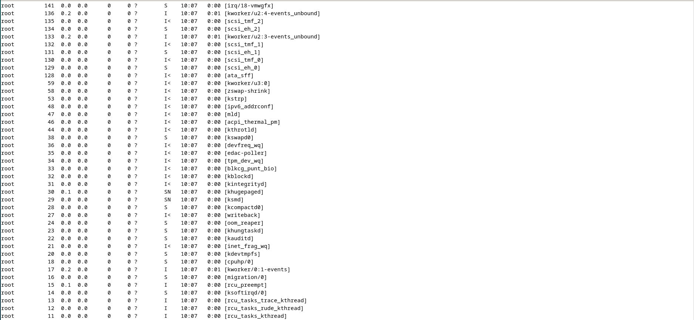
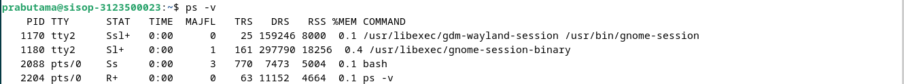
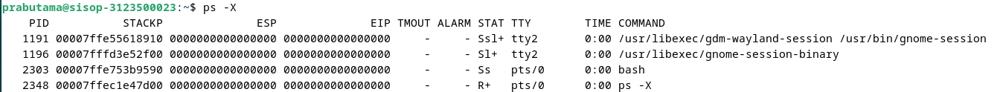
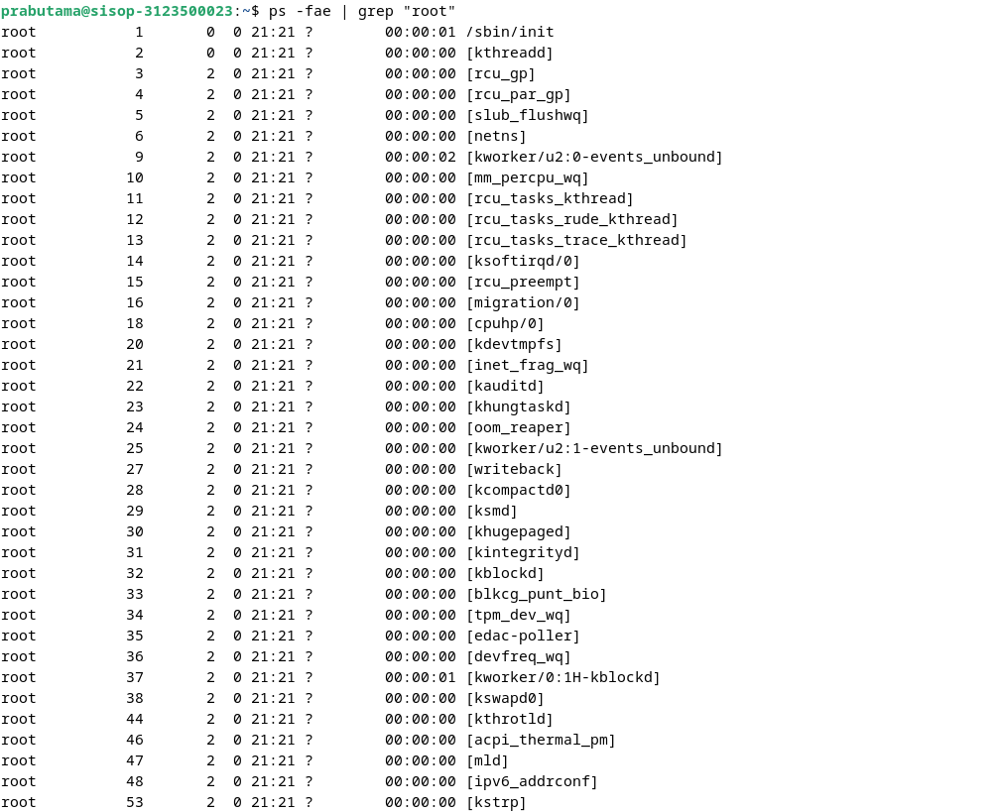

  <h2 style="text-align: center;font-weight: bold">LAPORAN PRAKTIKUM 6 SISTEM OPERASI </h2>
  <h4 style="text-align: center;">Dosen Pengampu : Dr. Ferry Astika Saputra, S.T., M.Sc.</h4>

 

  
  <h3 style="text-align: center;">Disusun Oleh :  Danur Isa Prabutama</h3>

<h3 style="text-align: center;line-height: 1.5">Politeknik Elektronika Negeri Surabaya Departemen Teknik Informatika Dan Komputer Program Studi Teknik Informatika 2024/2025</h3>
  

# Praktikum 4B | Week - 6
## Proses dan Manajemen Proses
### POKOK BAHASAN
- Proses pada Sistem Operasi Linux
- Manajemen Proses pada Sistem Operasi Linux
### TUJUAN BELAJAR
Setelah mempelajari materi dalam bab ini, mahasiswa diharapkan mampu:
- Memahami konsep proses pada sis tem operasi Linux.
- Menampilkan beberapa cara menampilkan hubungan proses parent dan child.
- Menampilkan status proses dengan beberapa format berbeda.
- Melakukan pengontrolan proses pada shell.
- Memahami penjadwalan prioritas.
### DASAR TEORI
#### 1.	KONSEP PROSES PADA SISTEM OPERASI LINUX
Proses adalah program yang sedang dieksekusi. Setiap kali menggunakan utilitas sistem atau program aplikasi dari shell, satu atau lebih proses ”child” akan dibuat oleh shell sesuai perintah yang diberikan. Setiap kali instruksi dibe rikan pada Linux shell, maka kernel akan menciptakan sebuah proses-id. Proses ini disebut juga dengan terminology Unix sebagai sebuah Job.   Proses Id (PID) dimulai dari 0, yaitu proses INIT, kemudian diikuti oleh proses berikutnya (terdaftar pada /etc/inittab).
Beberapa tipe proses :
- Foreground  
    Proses yang diciptakan oleh pemakai langsung pada terminal (interaktif, dialog)
- Batch  
    Proses yang dikumpulkan dan dijalankan secara sekuensial (satu persatu).   Prose Batch tidak diasosiasikan (berinteraksi) dengan terminal.
- Daemon  
    Proses yang menunggu permintaan (request) dari proses lainnya dan menjalankan tugas sesuai dengan permintaan tersebut. Bila tidak ada request, maka program ini akan berada dalam kondisi “idle” dan tidak menggunakan waktu hitung CPU. Umumnya nama proses daemon di UNIX berakhiran d, misalnya inetd, named, popd dll
#### 2. SINYAL
Proses dapat mengirim dan menerima sinyal dari dan ke proses lainnya. Proses mengirim sinyal melalui instruksi “kill” dengan format  
   
    kill [-nomor sinyal] PID
Nomor sinyal : 1 s/d maksimum nomor sinyal yang didefinisikan system Standar nomor sinyal yang terpenting adalah :

| No Sinyal | Nama       | Deskripsi      |
|-----------|------------|----------------|
| 1         | SIGHUP     | Hangup, sinyal dikirim bila proses terputus, misalnya melalui putusnya hubungan modem|
| 2         | SIGINT     | Sinyal interrupt, melalui ^C|
| 3         | SIGQUIT    | Sinyal Quit, melalui ^\|
| 9         | SIGKILL    | Sinyal Kill, menghentikan proses|
| 15        | SIGTERM    | Sinyal terminasi software|

#### 3. MENGIRIM SINYAL
Mengirim sinyal adalah satu alat komunikasi antar proses, yaitu memberitahukan proses yang sedang berjalan bahwa ada sesuatu yang harus dikendalikan. Berdasarkan sinyal yang dikirim ini maka proses dapat bereaksi dan administrator/programmer   dapat   menentukan   reaksi   tersebut.	Mengirim sinyal menggunakan instruksi

    kill [-nomor sinyal] PID
Sebelum mengirim sinyal PID proses yang akan dikirim harus diketahui terlebih dahulu.

#### 4. MENGONTROL PROSES PADA SHELL
Shell menyediakan fasilitas job control yang memungkinkan mengontrol beberapa job atau proses yang sedang berjalan pada waktu yang sama. Misalnya bila melakukan pengeditan file teks dan ingin melakukan interrupt pengeditan untuk mengerjakan hal lainnya. Bila selesai, dapat kembali (switch) ke editor dan melakukan pengeditan file teks kembali. 
Job bekerja pada <strong>foreground</strong> atau <strong>background</strong>. Pada foreground hanya diper untukkan untuk satu job pada satu waktu. Job pada foreground akan mengontrol shell - menerima input dari keyboard dan mengirim output ke layar. Job pada background tidak menerima input dari terminal, biasanya berjalan tanpa memerlukan interaksi 
Job pada foreground kemungkinan dihentikan sementara (suspend), dengan menekan [Ctrl-Z]. Job yang dihentikan sementara dapat dijalankan kembali pada foreground atau background sesuai keperluan dengan menekan <strong>”fg”</strong> atau <strong>”bg”</strong>. Sebagai catatan, menghentikan job seme ntara sangat berbeda dengan melakuakan interrupt job (biasanya menggunakan [Ctrl-C]), dimana job yang diinterrup akan dimatikan secara permanen dan tidak dapat dijalankan lagi.

#### 5. MENGONTROL PROSES LAIN
Perintah ps dapat digunakan untuk menunjukkan semua proses yang sedang berjalan pada mesin (bukan hanya proses pada shell saat ini) dengan format :

    ps –fae atau
    ps -aux
Beberapa versi UNIX mempunyai utilitas sistem yang disebut top yang menyediakan cara interaktif untuk memonitor aktifitas sistem. Statistik secara detail dengan proses yang berjalan ditampilkan dan secara terus-menerus di-refresh . Proses ditampilkan secara terurut dari utilitas CPU. Kunci yang berguna pada top adalah

    s – set update frequency
    u – display proses dari satu user
    k – kill proses (dengan PID)
    q – quit
Utilitas untuk melakukan pengontrolan proses dapat ditemukan pada sistem UNIX adalah perintah killall. Perintah ini akan menghentikan proses sesuai PID atau job number proses.

#### Percobaan 5 : Menghentikan dan memulai kembali job
1.	Cara lain meletakkan job pada background dengan memulai job secara normal (pada foreground), stop job dan memulai lagi pada background

        $ yes > /dev/null
    
    

    Analisa : Perintah tersebut digunakan untuk membelokkan output dari program yes ke file /dev/null

    Hentikan sementara job (suspend ), bukan menghentikannya (terminate ), tetapi menghentikan sementara job sampai di restart. Untuk menghentikan sementara job gunakan Ctrl-Z.

    

    Analisa : proses yes akan berhenti sementara karena di interupsi dengan perintah ctrl-Z

2.	Untuk restart job pada foreground , gunakan perintah fg.

        $ fg

    

    Analisa : Perintah di background akan dipindahkan ke foreground dengan perintah `fg`

3.	Shell akan menampilkan nama perintah yang diletakkan di foreground.Stop job lagi dengan Ctrl-Z. Kemudian gunakan perintah bg untuk meletakkan job pada background .

    

    Analisa : Menampilkan proses di foreground

        $ bg

    

    Job tidak bisa dihentikan dengan Ctrl-Z karena job berada pada background.Untuk menghentikannya, letakkan job pada foreground dengan fg dan kemudian hentikan sementara dengan Ctrl-Z.
    
        $ fg

    

    Analisa : Meletakkan proses pada foreground dan menghentikan sementara.

4.	Job pada background dapat digunakan untuk menampilkan teks pada terminal, dimana dapat diabaikan jika mencoba mengerjakan job lain.

        $ yes &

    Untuk menghentikannya tidak dapat menggunakan Ctrl-C. Job harus dipindah ke foreground, baru dihentikan dengan cara tekan fg dan tekan Enter, kemudian dilanjutkan dengan Ctrl-Z untuk menghentikan sementara.

    

    Analisa : Menjalankan proses yes pada background dan meletakkan proses di foreground kemudian menghentikan proses sementara dengan ctrl + z.

5.	Apabila ingin menjalankan banyak job dalam satu waktu, letakkan job pada foreground atau background dengan memberikan job ID5 gunakan perintah `fg %2`, `bg %2`, atau `%2`

    

    Analisa : Proses akan berjalan lagi di foreground karena saya menggunakan perintah `fg %2`   

6.	tekan fg dan tekan Enter, kemudian dilanjutkan dengan Ctrl -Z untuk menghentikan sementara.

    

    Analisa : Menghentikan proses sementara hanya dengan ctrl + z karena proses sudah berada di foreground.

7.	Lihat job dengan perintah ps -fae dan tekan Enter. Kemudian hentikan proses dengan perintah kill.

        $ ps -fae
        $ kill -9 <NomorPID>

    

    Analisa : Menampilkan job yang sedang berjalan dan melakukan kill pada salah satu job.

8.	Logout dan tekan Alt+F7 untuk kembali ke mode grafis

#### Percobaan 6 : Percobaan dengan Penjadwalan Prioritas
1.	Login sebagai root.
2.	Buka 3 terminal, tampilkan pada screen yang sama.

    

    Analisa : Menjalankan 3 terminal dan login sebagai root. 

3.	Pada setiap terminal, ketik PS1 = ” \w:” diikuti Enter. \w menampilkan path pada direktori home.

    

    Analisa : Perintah `\w` akan menampilkan path `/home/prabutama` 

4.	Karena login sebagai root, maka akan ditampilkan ~: pada setiap terminal. Untuk setiap terminal ketik pwd dan tekan Enter untuk melihat bahwa Anda sedang berada pada direktori /root.

    

    Analisa : Perintah `pwd` pada masing masing terminal akan menghasilkan output `/root`.

5.	Buka terminal lagi (keempat), atur posisi sehingga keempat terminal terlihat
pada screen.
6.	Pada terminal keempat, ketik top dan tekan Enter. Maka program   top akan muncul. Ketik i. Top akan menampilkan proses yang aktif. Ketik lmt. Top tidak lagi menampilkan informasi pada bagian atas dari screen. Pada percobaan ini, terminal ke empat sebagai jendela Top.

    

    Analisa : Perintah `top` untuk memberikan gambaran real-time tentang kinerja sistem secara keseluruhan. dan dengan menekan tombol `i` akan menampilkan proses yang sedang aktif. dan ketika menekan `lmt` Top tidak lagi menampilkan informasi pada bagian atas dari screen.

7.	Pada terminal 1, bukalah program executable C++ dengan mengetik program
yes dan tekan Enter.
8.	Ulangi langkah 7 untuk terminal 2.
9.	Jendela Top akan menampilkan dua program yes sebagai proses yang berjalan. Nilai %CPU sama pada keduanya. Hal ini berarti kedua proses mengkonsumsi waktu proses yang sama dan berjalan sama cepat. PID dari kedua proses akan berbeda, misalnya 3148 dan 3149. Kemudian gunakan terminal 3 (yang tidak menjalankan primes maupun Jendela Top) dan ketik renice 19 <PID terimnal 1> (contoh : renice 19 3148) dan diikuti Enter. Hal ini berarti mengganti penjadwalan prioritas dari proses ke 19.
10.	Tunggu beberapa saat sampai program top berubah dan terlihat pada jendela Top. Pada kolom STAT memperlihatkan N untuk proses 3148. Hal ini berarti bahwa penjadwalan prioritas untuk proses 3148 lebih besar (lebih lambat) dari 0. Proses 3149 berjalan lebih cepat.

     

    Analisa : Setelah PID 2308 di renice ke nilai -19, maka prioritas PID 2308 lebih besar dari proses 2309, tetapi proses 2309 akan berjalan lebih cepat dari 2308 karena semakin besar nilai PR akan semakin lambat proses berjalan.

11.	Program top juga mempunyai fungsi yang sama dengan program renice. Pilih Jendela Top dan tekan r. Program top terdapat prompt PID to renice: tekan 3148 (ingat bahwa Anda harus mengganti 3148 dengan PID Anda sendiri) dan tekan Enter. Program top memberikan prompt Renice PID 3148 to value: tekan -19 dan tekan Enter.

    

    Analisa : Melakukan renice lagi untuk PID 2308 menjadi -19

12.	Tunggu beberapa saat sampai top berubah dan lihat nilai %CPU pada kedua proses. Sekarang proses 3148 lebih cepat dari proses 3149. Kolom status menunjukkan < pada proses 3148 yang menunjukkan penjadwalanprioritas lebih rendah (lebih cepat) dari nilai 0

    

    Analisa : Melakukan renice lagi untuk PID 2308 menjadi -19 yang membuat proses 2308 akan berjalan lebih cepat dari PID 2309

13.	Pilih terminal 3 (yang sedang tidak menjalankan yes atau program top) dan ketik nice –n -10 yes dan tekan Enter. Tunggu beberapa saat agar program top berubah dan akan terlihat proses primes ketiga. Misalnya PID nya 4107. Opsi -10 berada pada kolom NI (penjadwalan prioritas).

    

    Analisa : Dengan menggunakan perintah nice -n -10, prioritas penjadwalan proses yes ditingkatkan secara signifikan, sehingga proses tersebut mendapatkan alokasi sumber daya CPU yang lebih besar. Hal ini terlihat dalam output top di mana proses yes atau mungkin primes dengan PID tertentu muncul dengan prioritas yang tinggi (NI -10), menunjukkan perubahan dalam alokasi sumber daya CPU untuk proses tersebut.

14.	Jangan menggunakan mouse dan keyboard selama 10 detik. Program top menampilkan proses yang aktif selain program yes. Maka akan terlihat proses top terdaftar tetapi %CPU kecil (dibawah 1.0) dan konsisten. Juga terlihat proses berhubungan dengan dekstop grafis seperti X, panel dll.

    

    Analisa : program top akan menampilkan proses yang sedang berjalan di latar belakang, kecuali program yes. Proses top itu sendiri mungkin akan terdaftar di dalamnya, dengan persentase penggunaan CPU-nya rendah (kurang dari 1.0) dan stabil karena hanya memantau aktivitas sistem. Selain itu, kita kemungkinan akan melihat proses terkait dengan desktop grafis seperti X server, panel, dan proses lain yang terlibat dalam manajemen antarmuka pengguna grafis. Ini menunjukkan bahwa meskipun tidak ada interaksi langsung dengan mouse dan keyboard, sistem masih menjalankan proses latar belakang untuk mendukung fungsi sistem dan antarmuka pengguna grafis.

15.	Pindahkan mouse sehingga kursor berubah pada screen dan lihat apa yang terjadi dengan tampilan top. Proses tambahan akan muncul dan nilai %CPU berubah sebagai bagian grafis yang bekerja. Satu alasan adalah bahwa proses 4107 berjalan pada penjadwalan prioritas tinggi. Pilih jendela Top, ketik r. PID to renice : muncul prompt. Ketik 4107 (ubahlah 4107 dengan PID Anda) dan tekan Enter. Renice PID 4107 to value: muncul prompt. Ketik 0 dan tekan Enter. Sekarang pindahkan mouse ke sekeliling screen. Lihat perubahannya.

    

    Analisa :  pengguna menggunakan perintah top untuk memantau aktivitas sistem. Saat mouse dipindahkan, aktivitas tambahan muncul dalam tampilan top. Pengguna juga mengubah prioritas suatu proses menggunakan renice, yang dapat memengaruhi alokasi sumber daya. Melakukan perubahan kembali ke prioritas standar memungkinkan observasi dampaknya pada penggunaan sumber daya. Saat mouse dipindahkan, respons sistem terhadap gerakan tersebut tercermin dalam perubahan aktivitas CPU atau sumber daya lainnya, yang dapat diamati dalam tampilan top. Ini menunjukkan bagaimana interaksi pengguna dan perubahan prioritas dapat memengaruhi penggunaan sumber daya.

16.	Tutup semua terminal window.
17.	Logout dan login kembali sebagai user.

    

#### LATIHAN
1.	Masuk ke tty2 dengan Ctrl+Alt+F2. Ketik ps – au dan tekan Enter. Kemudian perhatikan keluaran sebagai berikut :

    

    Analisa : Perintah ps -au digunakan untuk menampilkan informasi tentang semua proses yang sedang berjalan di sistem, dengan detail tambahan tentang pengguna yang menjalankan setiap proses. 

    a.	Sebutkan nama -nama proses yang bukan root

    | USER                | PID                | COMMAND                |
    |------------------------|------------------------|------------------------|
    | prabuta+  | 1191  | /usr/libexec/gdm-wayland-s  |
    | prabuta+  | 1196  | /usr/libexec/  |
    | prabuta+  | 2014  | bash  |
    | prabuta+  | 2597  | ps -au  |

    b.	Tulis PID dan COMMAND dari proses yang paling banyak menggunakan CPU time

    PID : 2597  
    COMMAND : ps -au

    c.	Sebutkan buyut proses dan PID dari proses tersebut

     

     Analisa : Buyut proses PID 2597 adalah 1813 & 2014, ini saya temukan menggunakan perintah `ps -o ppid=2597`

    d.	Sebutkan beberapa proses daemon
    
    1. apache2: Proses daemon yang menjalankan server web Apache.
    2. sshd: Layanan SSH (Secure Shell) yang menjalankan server SSH di sistem.
    3. mysql: Proses daemon yang menjalankan server basis data MySQL.
    4. cron: Layanan cron untuk menjalankan tugas terjadwal pada interval tertentu.
    5. systemd: Manajer sistem init yang mengatur proses booting dan manajemen layanan.
    6. NetworkManager: Manajer jaringan yang memfasilitasi pengelolaan koneksi jaringan.
    7. avahi-daemon: Proses daemon yang menyediakan layanan Zeroconf (mDNS/DNS-SD).
    8. dhclient: Proses daemon untuk menangani koneksi jaringan melalui DHCP.

    e.	Pada prompt login lakukan hal- hal sebagai berikut :

    $ csh

    $ who

    $ bash

    $ ls

    $ sh

    $ ps

    

    Analisa :
     
    $ csh: Ini memulai shell C (C Shell).

    $ who: Ini menampilkan daftar pengguna yang saat ini masuk.

    $ bash: Ini mencoba beralih ke shell Bash, tetapi tidak bisa dilakukan langsung setelah menjalankan shell lain. Anda mungkin akan melihat pesan kesalahan di sini.

    $ ls: Ini akan mencoba menjalankan perintah ls yang akan menampilkan daftar file dan direktori dalam direktori saat ini.

    $ sh: Ini mencoba beralih kembali ke shell standar (biasanya Bourne Shell atau Bourne Again Shell, tergantung pada sistem operasi), namun seperti sebelumnya, beralih shell langsung setelah menjalankan shell lain tidak mungkin dilakukan.

    $ ps: Ini akan menampilkan daftar proses yang sedang berjalan. Dalam konteks ini, akan menampilkan proses yang sedang berjalan pada shell C (csh) yang sebelumnya kita mulai.

    f.	Sebutkan PID yang paling besar dan kemudian buat urut-urutan proses sampai ke PPID = 1.

        PID terbesar = 2218

    
    
    
    
    

    Analisa : Menampilkan urutan proses dari yang PID terbesar sampai ke PID 1.
    

2.	Cobalah format tampilan ps dengan opsi berikut dan perhatikan hasil tampilannya :

	-f	daftar penuh  
    

    Analisa : opsi -f digunakan untuk menampilkan output dalam format yang lengkap atau penuh. Ini biasanya mencakup informasi seperti pengguna yang menjalankan proses, PID (Process ID), PID induk (Parent Process ID), waktu mulai proses, dan perintah yang dijalankan. 

	-j	format job  
    

    Analisa : opsi -j digunakan untuk menampilkan informasi tentang job control untuk setiap proses. Job control adalah mekanisme dalam sistem Unix/Linux yang memungkinkan pengguna untuk mengelola dan mengontrol proses yang berjalan di terminal. 

	-j	format job control  
    

    Analisa : opsi -j digunakan untuk menampilkan informasi tentang job control untuk setiap proses. Job control adalah mekanisme dalam sistem Unix/Linux yang memungkinkan pengguna untuk mengelola dan mengontrol proses yang berjalan di terminal. 

	-l	daftar memanjang  
    

    Analisa : opsi -l digunakan untuk menampilkan output dalam format yang lebih panjang atau rinci. Ini biasanya menambahkan informasi tambahan seperti nama lengkap dari pengguna yang menjalankan proses, perintah yang dijalankan, dan waktu mulai proses. 

	-s	format sinyal  
    

    Analisa : opsi -s tidak umum digunakan untuk format sinyal. Namun, opsi ini dapat digunakan untuk menampilkan informasi tentang sinyal yang dikirimkan kepada proses. Misalnya, jika Anda menggunakan ps -s <PID>, Anda dapat melihat daftar sinyal yang telah dikirimkan kepada proses dengan ID proses (PID) yang spesifik

	-v	format virtual memory  
     

     Analisa : opsi -v digunakan untuk menampilkan informasi tentang penggunaan memori virtual oleh setiap proses. Ini termasuk informasi tentang ukuran total memori virtual yang dialokasikan, ukuran memori yang saat ini digunakan, dan ukuran memori yang terlibat (memori yang telah diambil dari memori fisik).

	-X	format register i386  
     

     Aalisa : opsi -x digunakan untuk menampilkan semua proses, bahkan yang tidak terkait dengan terminal pengguna (tidak terkendali).

3.	Lakukan urutan pekerjaan berikut :

    a.	Gunakan perintah find ke seluruh direktory pada sistem, belokkan output sehingga daftar direktori dialihkan ke file directories.txt dan daftar pesan error dialihkan ke file errors.
    
    

    Analisa : Perintah `find` digunakan untuk mencari ke seluruh direktori pada sistem, dimulai dari root directory (/). Dengan mengalihkan output dari perintah find ke file directories.txt, kita dapat dengan mudah menyimpan daftar lengkap dari semua direktori dalam sistem ke dalam sebuah file. Pemisahan pesan error menggunakan `2>` errors memungkinkan untuk menangkap dan menyimpan pesan error (jika ada) ke dalam file terpisah bernama errors.
    
    b.	Gunakan perintah `sleep 5`. Apa yang terjadi dengan perintah ini ?
    

    Analisa : perintah sleep digunakan untuk membuat proses tertunda (sleep) dalam sistem operasi Unix/Linux untuk jangka waktu tertentu yang ditentukan sebelum melanjutkan eksekusi perintah berikutnya.

    c.	Jalankan perintah pada background menggunakan &
    

    Analisa : proses akan berjalan di background dengan nomor PID yang telah ditampilkan. 
    
    d.	Jalankan `sleep 15` pada foreground , hentikan sementara dengan Ctrl- Z dan kemudian letakkan pada background dengan bg.   Ketikkan jobs. Ketikkan ps. Kembalikan job ke foreground dengan perintah fg.

    

    Analisa : Langkah-langkah tersebut mencerminkan pengelolaan proses dalam lingkungan shell UNIX. Dengan menjalankan sleep 15 pada foreground, menghentikannya sementara dengan Ctrl-Z, dan kemudian memindahkannya ke background menggunakan bg, kita dapat mengontrol eksekusi proses dalam lingkungan shell. Penggunaan perintah jobs memungkinkan kita untuk melihat daftar pekerjaan yang sedang berjalan, sementara ps memberikan informasi lebih lanjut tentang semua proses yang berjalan, termasuk proses yang berjalan di background. Kembali memindahkan pekerjaan ke foreground dengan fg memungkinkan kita untuk berinteraksi kembali dengan proses tersebut secara langsung. Ini menunjukkan fleksibilitas dan kontrol yang dimiliki oleh pengguna dalam manajemen proses dalam sistem operasi UNIX/Linux.

    e.	Jalankan `sleep 15` pada background menggunakan `&` dan kemudian gunakan perintah kill untuk menghentikan proses diikuti job number.

    

    Analisa : sleep 15 akan berjalan di latar belakang dan kemudian menghentikan proses tersebut menggunakan perintah kill dengan menyertakan nomor pekerjaan yang terkait dengan proses tersebut.

    f.	Jalankan `sleep 15` pada background menggunakan & dan kemudian gunakan kill untuk menghentikan sementara proses. Gunakan bg untuk melanjutkan menjalankan proses.

    

    Analisa : Dengan menggunakan perintah `sleep 15 &`, proses sleep 15 dijalankan di latar belakang. Kemudian, menggunakan perintah kill dengan argumen nomor pekerjaan yang sesuai, proses tersebut dihentikan sementara. Setelah itu, dengan menggunakan perintah bg, proses sleep 15 dilanjutkan kembali di latar belakang, memungkinkan proses tersebut untuk berlanjut setelah sementara dihentikan.
    
    g.	Jalankan `sleep 60` pada background 5 kali dan terminasi semua pada dengan menggunakan perintah killall

    

    Analisa : Dengan menjalankan sleep 60 pada background sebanyak lima kali, kita menciptakan lima proses yang akan menunggu selama 60 detik sebelum selesai. Kemudian, dengan menggunakan perintah killall, kita menghentikan semua proses sleep yang sedang berjalan secara bersamaan. Ini merupakan pendekatan efisien untuk mengelola banyak proses yang berjalan di latar belakang, memberikan kontrol yang cepat dan mudah untuk menghentikan semua proses dengan nama yang sama dalam satu langkah, mempercepat administrasi sistem dalam situasi semacam ini.

    h.	Gunakan perintah ps, w dan top untuk menunjukkan semua proses yang sedang dieksekusi.
    
    

    Analisa : Kombinasi dari perintah ps aux, w, dan top memberikan pandangan yang komprehensif terhadap semua proses yang sedang dieksekusi di sistem Linux. Perintah ps aux memberikan informasi rinci tentang setiap proses, termasuk PID, pengguna yang menjalankannya, dan penggunaan CPU. w memberikan gambaran tentang aktivitas pengguna yang sedang login, sementara top memberikan tampilan real-time yang memungkinkan pemantauan langsung terhadap penggunaan CPU, memori, dan proses-proses yang berjalan.

    i.	Gunakan perintah `ps –aeH` untuk menampilkan hierarki proses. Carilah init proses. Apakah Anda bisa identifikasi sistem daemon yang penting ? Dapatkan Anda identifikasi shell dan subprose s ?
    
    
    
    
    

    Analisa : perintah `ps –aeH` akan menampilkan hierarki proses, tetapi saya tidak menemukan proses init dengan PID = 1, karena Pada beberapa sistem Linux yang lebih baru, seperti sistem yang menggunakan systemd sebagai inisiasi (init system), proses dengan PID 1 bukan lagi proses init tradisional. Sebaliknya, systemd dijalankan sebagai proses dengan PID 1. Ini adalah arsitektur yang diperkenalkan oleh banyak distribusi Linux modern. 

    j.	Kombinasikan `ps –fae` dan grep, apa yang Anda lihat ?
    

    Analisa : pada percobaan diatas saya menggunakan kombinasi `ps -fae` dan `grep "root"` untuk mencari proses yang berjalan oleh user root 

    k.	Jalankan proses `sleep 300` pada background. Log off komputer dan log in kembali. Lihat daftar semua proses yang berjalan. Apa yang terjadi pada proses sleep ?

    

    Setelah Logout & Login Kembali 

    

    Analisa : proses `sleep` yang berjalan di latar belakang dan kemudian log out dan log in kembali, proses sleep akan tetap berjalan tanpa terpengaruh. Ini menunjukkan bahwa proses tersebut tidak terkait dengan sesi pengguna dan tetap berjalan secara independen di sistem. Analisis ini menunjukkan fleksibilitas sistem operasi dalam menjalankan proses di latar belakang tanpa ketergantungan pada aktivitas pengguna.

    -----------------------------------------------------------

