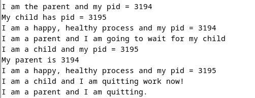

<div align="center">
  <h2 style="text-align: center;font-weight: bold">LAPORAN PRAKTIKUM 7 SISTEM OPERASI</br></h2>
  <h4 style="text-align: center;">Dosen Pengampu : Dr. Ferry Astika Saputra, S.T., M.Sc.</h4>
</div>
<br />
<div align="center">
  
  <h3 style="text-align: center;">Disusun Oleh : <br>Danur Isa Prabutama</h3>

<h3 style="text-align: center;line-height: 1.5">Politeknik Elektronika Negeri Surabaya<br>Departemen Teknik Informatika Dan Komputer<br>Program Studi Teknik Informatika<br>2024/2025</h3>
  <hr><hr>
</div>

# Minggu ke 7  
## Fork : Parent - Child Process
Panggilan sistem Fork digunakan untuk membuat proses baru di Linux, dan sistem Unix, yang disebut proses anak , yang berjalan bersamaan dengan proses yang membuat panggilan fork() (proses induk). Setelah proses anak baru dibuat, kedua proses akan menjalankan instruksi berikutnya setelah panggilan sistem fork().</br>pc yang sama (penghitung program), register CPU yang sama, dan file terbuka yang sama yang digunakan dalam proses induk. Tidak memerlukan parameter dan mengembalikan nilai integer.

Konsep fork adalah salah satu konsep fundamental dalam sistem operasi Unix dan turunannya, yang memungkinkan proses untuk membuat salinan dirinya sendiri. Implementasi fork memungkinkan proses untuk melakukan multitasking, yaitu menjalankan beberapa tugas secara bersamaan.Dalam bahasa pemrograman C, implementasi fork dapat dilakukan menggunakan fungsi fork() yang tersedia dalam library unistd.h. Berikut adalah contoh implementasi sederhana dari fork dalam bahasa pemrograman C: 


Implementasi fork memungkinkan kita untuk membuat aplikasi yang melakukan beberapa tugas secara bersamaan, meningkatkan efisiensi dan responsivitas sistem. Hal ini sangat berguna dalam pengembangan perangkat lunak yang memerlukan multitasking, seperti server web, aplikasi jaringan, dan sebagainya.

## Visualisasi Pohon Proses

#### 1. `fork01.c`
#### Kode Program:

#### Output:

#### Visualisasi: 
```
int main() { 
    for(int i = 0; i < 3; i++) {

                    pid: 3236, ppid: 2216, uid: 1000
                             [Main process]
                                    |  
                                sleep(3)                
                                    |   
                    pid: 3236, ppid: 2216, uid: 1000   
                              [Main Process]  
                                    |
                                sleep(3)
                                    |  
                    pid: 3236, ppid: 2216, uid: 1000   
                              [Main Process]
                                    |
                                sleep(3)
    }
  return 0;
}
```

#### Analisa: 
Program diatas adalah prgram yang diguakan untuk mengetahui nilai PID, PPID, dan UID dari sebuah proses.Informasi tersebut akan di tampilkan 3 kali dan pada setiap iterasinya akan ada jeda 3 detik yang disebabkan oleh fungsi sleep(3).

### 2. `fork02.c`
#### Kode Program: 

#### Output: 

#### Visualisasi: 
```
int main() { 
  fork();            > Child process created <
                                +
                              /   \
                             /     \
                            /       \
  while(1) {               /         \
            pid: 3751, ppid: -       pid: 3752, ppid: 3751
        [Parent Process] x = 5       [Child Process] x = 5
                            \       /
                             \     /  
                              \   /
                                |
                             sleep(2) 
                                |
                               x++                           
  }      
  return 0;
}
```
Analisa : Program diatas adalah program implementasi dari fork() didalam bahasa c dimana ada 2 proses yang memiliki hubungan parent dan child. proses pertama memiliki PID: 3571 dan PPID yang tidak diketahui yang merupakan proses utama.Setelah program menjalankan fungsi fork() maka akan tercipta proses baru yaitu child dengan PID: 3752 dan PPID: 3571 (PID dari proses utama). Kedua proses itu akan berjalan masing masing dan akan memberikan keluaran yang sama yaitu nilai x yang bertambah setiap iterasi dengan jeda 2 detik yang disebabkan oleh sleep(2).Perulangannya akan berjalan terus karena pada kondisi while bernilai 1 atau true.   

### 3. `fork03.c`
#### Kode Program: 

#### Output: 

#### Visualisasi:
```
int main() { 
  fork();            > Child process created <
                                +
                              /   \
                             /     \
                            /       \
  loop 0 to 5 {            /         \
           pid: 4150, ppid: -       pid: 4151, ppid: 4150
           [Parent Process]          [Child Process]
                            \       /
                             \     /  
                              \   /
                                |
                             sleep(2) 
                                |
                               x++                           
  }      
  return 0;
}
```
#### Analisa: 
Program diatas adalah program implementasi dari fork() didalam bahasa c dimana ada 2 proses yang memiliki hubungan parent dan child. proses pertama memiliki PID: 4150 dan PPID yang tidak diketahui yang merupakan proses utama.Setelah program menjalankan fungsi fork() maka akan tercipta proses baru yaitu child dengan PID: 4151 dan PPID: 4150 (PID dari proses utama). Kedua proses itu akan berjalan masing masing.Perulangannya akan berjalan sampai 5 kali dengan jeda selama 2 detik yang disebabkan oleh sleep(2)

### 4. `fork04.c`
#### Kode Program: 


#### Output: 

#### Visualisasi: 
```
int main() { 
  fork();            > Child process created <
                                +
                             /     \
                            /       \
                pid: 3194, ppid: -   \ 
               [Parent Process]       \
                        |              \
                        |               \ 
                        |       pid: 3195, ppid: 3194
                      wait          [Child Process]
                        |            /
                         \          /
                          \        /  
                           \      /   
                              |
                              |
                             exit                         
  return 0;
  }      
```
#### Analisa: 
Program tersebut melakukan proses forking untuk menciptakan proses anak. Proses induk mencetak pesan yang menunjukkan identitasnya, yaitu "I am the parent and my pid = 36382", di mana 36382 adalah PID dari proses induk itu sendiri. Sementara proses anak mencetak pesan "My parent is 36382" diikuti dengan PID-nya sendiri, yaitu "I am a child and my pid = 36383". Keduanya kemudian mencetak pesan yang serupa. Proses anak kemudian memberikan pesan penutup "I am a child and I am quitting work now!" untuk menandakan berhentinya prosesnya. Proses induk menyusul dengan mencetak pesan "I am the parent and I am quitting". 

### 5. `fork05.c`
#### Kode Program: 


#### Output: 

#### Visualisasi: 
```
int main() { 
  fork();            > Child process created <
                                +
                             /     \
                            /       \
                pid: 3310, ppid: -   \ 
               [Parent Process]       \
                        |              \
                        |               \ 
                        |       pid: 3311, ppid: 3310
                      wait              total 20
                        |            excel(/bin/ls)               
                        |          [Child Process]
                        |            /
                         \          /
                          \        /  
                           \      /   
                              |
                              |
                             exit                         
  return 0;
  }      
```
#### Analisa: 
Program diatas adalah program implementasi fork() dengan dua proses yang menghubungkan parent dan child. Proses pertama memiliki PID: 3495 dan PPID yang tidak diketahui, yang merupakan proses utama (main program atau parent). Setelah program menjalankan fungsi fork(), akan muncul proses baru dengan PID: 3496 dan PPID: 3495. Setelah parent program memberikan output yang menunjukkan nomor PID dan PID child, parent program akan menunggu atau menunggu anak berjalan. Setelah anak berjalan dan memberikan output yang menunjukkan nomor PID dan PID anak, parent program akan langsung keluar dari proses. Setelah anak keluar dari proses, parent program juga akan keluar dari proses.

### 6. `fork06.c`
#### Kode Program: 


#### Output: 

#### Visualisasi: 
```
int main() { 
  fork();            > Child process created <
                                +
                             /     \
                            /       \
                pid: 3362, ppid: -   \ 
               [Parent Process]       \
                        |              \
                        |               \ 
                        |       pid: 3363, ppid: 3362
                      wait              total 20
                        |            execl(fork3)               
                        |          [Child Process]
                        |            /
                         \          /
                          \        /  
                           \      /   
                              |
                              |
                             exit                         
  return 0;
  }      
```
#### Analisa: 
Proses induk mencetak pesan yang menyatakan identitasnya sebagai "I am the parent and my pid = 36440", di mana 36440 adalah PID dari proses induk itu sendiri. Sementara itu, proses anak mencetak pesan "My parent is 36440" diikuti dengan PID-nya sendiri, yaitu "I am a child and my pid = 36441". Keduanya juga mencetak pesan yang menunjukkan bahwa mereka adalah proses yang sehat dan bahagia dengan PID masing-masing. Kemudian, kedua proses terus mencetak pesan "This is process XXXX", di mana XXXX menunjukkan PID masing-masing proses, menunjukkan iterasi dalam siklus kerjanya. Akhirnya, proses induk mengakhiri eksekusinya dengan mencetak pesan "I am the parent and I am quitting.".

## Program Perkalian Matriks dengan menggunakan fork()
#### Kode Program: 
    #include <stdio.h>
    #include <stdlib.h>
    #include <unistd.h>
    #include <sys/types.h>
    #include <sys/wait.h>

    #define MATRIX_SIZE 4

    void cetakMatrix(int matrix[MATRIX_SIZE][MATRIX_SIZE]) {
      for (int i = 0; i < MATRIX_SIZE; i++) {
        for (int j = 0; j < MATRIX_SIZE; j++) {
          printf("%d ", matrix[i][j]);
        }
        printf("\n");
      }
    }

    int main() {
      int matrix1[MATRIX_SIZE][MATRIX_SIZE] = {{2, -1, 1, 3},{4, 0, 2, 5},{-2, 1, 4, -1},{1, 3, -2, 0}};
      int matrix2[MATRIX_SIZE][MATRIX_SIZE] = {{1,2,4,7}, {3,1,-2,5}, {5,0,1,9},{2,4,-3,1}};
      int result[MATRIX_SIZE][MATRIX_SIZE] = {0};

      int i, j, k;
      int status;
      pid_t pid;

      printf("Matrix Pertama:\n");
      cetakMatrix(matrix1);
      printf("Matrix Kedua:\n");
      cetakMatrix(matrix2);

      for (i = 0; i < MATRIX_SIZE; i++) {
        for (j = 0; j < MATRIX_SIZE; j++) {
          pid = fork();
          if (pid == 0) { // Child Process
            int sum = 0;
            for (k = 0; k < MATRIX_SIZE; k++) {
              sum += matrix1[i][k] * matrix2[k][j];
            }
            exit(sum);
          } else if (pid > 0) { // Parent Process
            waitpid(pid, &status, 0);
            result[i][j] += WEXITSTATUS(status); // Menambahkan hasil perkalian yang telah dihitung Child Process
          } else {
            printf("Fork() Gagal!\n");
            exit(1);
          }
        }
      }

      printf("\nHasil Perkalian Matrix:\n");
      cetakMatrix(result);

      return 0;
    }
#### Output:

#### Analisa:
Program tersebut adalah program untuk menghitung perkalian matrix ordo 4x4, menggunakan fungsi fork() berperan sebagai child proses untuk menghitung setiap baris, waitpid() berperan sebagai parent proses untuk menunggu proses fork() selesai, dan WEXITSTATUS untuk menambahkan hasil perhitungan dari child proses ke dalam matrix result, ini penting karena hasil yang dihitung oleh child proses tidak bisa langsung ditambahkan kedalam result melainkan hanya disimpan didalam tiruannya saja. Jika sudah selesai maka hasil perkalian akan dicetak. Proses fork() dan waitpid() ini mirip dengan proses async-await dalam bahasa-bahasa tingkat tinggi seperti Java dan Python.