<div align="center">
  <h2 style="text-align: center;font-weight: bold">LAPORAN PRAKTIKUM * SISTEM OPERASI</br></h2>
  <h4 style="text-align: center;">Dosen Pengampu : Dr. Ferry Astika Saputra, S.T., M.Sc.</h4>
</div>
<br />
<div align="center">
  
  <h3 style="text-align: center;">Disusun Oleh : <br>Danur Isa Prabutama</h3>

<h3 style="text-align: center;line-height: 1.5">Politeknik Elektronika Negeri Surabaya<br>Departemen Teknik Informatika Dan Komputer<br>Program Studi Teknik Informatika<br>2024/2025</h3>
  <hr><hr>
</div>


## Minggu Ke 8 
## Pemrograman Bash 
Shell adalah penerjemah baris perintah, Ini adalah aplikasi untuk memberikan perintah ke berbagai sistem operasi seperti Linux, Unix, dan Mac.

Bash adalah versi shell yang disempurnakan, lapisan antara panggilan fungsi pengguna dan sistem operasi.

### Pengertian Bash?
Bash adalah kependekan dari Bourne Again Shell, adalah penerjemah shell baris perintah dan bahasa skrip sumber terbuka. Ini menafsirkan perintah yang dimasukkan pengguna, baik secara interaktif atau dari file skrip.
### Jensi Mode Bash
- Mode interaktif: Juga disebut penerjemah perintah, memungkinkan eksekusi perintah di terminal. Ini mengeksekusi perintah secara berurutan jika ada beberapa perintah.
- Mode non-interaktif: Ini merujuk pada skrip, memungkinkan Anda menulis sintaksis Bash yang berisi rangkaian beberapa perintah untuk eksekusi skrip.

### Perbedaan Bash & Shell
- Shell : penerjemah baris perintah untuk OS Unix dan Linux
- Bash : Versi shell yang lebih sempurna

### Bahasa Pengkodean Bash
Bash menjalankan perintah dari terminal atau file. Ini adalah bahasa pemrograman yang beroperasi pada sistem operasi kernel Unix/Linux, berisi semua fitur untuk menulis kode lengkap.

## Variabel
### Cara Deklarasi variabel di bash


Output: 


Kode di atas mendeklarasikan variabel yang diberi nama AGE dengan nilai 25dan kemudian digunakan echo untuk menampilkan nilai variabel AGE. Simbol dollarsebelum nama variabel sangat penting untuk mengakses nilainya.

### Variabel Readonly Bash
Setelah variabel diberi nilai, Anda dapat mengubahnya ke nilai baru menggunakan operator penugasan =.


Output: 


Bagaimana Anda membuat variabel tidak dapat diperbarui?

Kata `readonly` mencegah variabel diperbarui, secara efektif mengubahnya menjadi `constant`.


AGE adalah sebuah constant, menetapkan nilai baru akan menimbulkan kesalahan, dan pesan kesalahannya adalah AGE: is read-only.


### Variabel Unset Bash

Kata `unset` membantu menghilangkan nilai dari variabel yang ditentukan. Variabel tetap dapat diakses tetapi mencetak nilai kosong.


Output: 


### Jenis Variabel
- Variabel Global: 

    Variabel global dapat diakses dalam suatu fungsi atau blok bersarang apa pun dari file skrip shell. Variabel default yang dideklarasikan dalam file skrip disebut variabel global.

    

    Output: 

    

- Variabel Lokal: 

    Variabel lokal dideklarasikan di dalam blok kode atau fungsi. Cakupan variabel-variabel ini hanya terlihat di dalam blok tempat variabel-variabel tersebut dideklarasikan.

    

    Output: 

    

## Loop FIle
### Membaca file dari baris menggunakan perulangan
Membaca isi di dalam file dengan menggunakan perulangan while


Output: 


## Comment
`Comments` adalah pernyataan kode yang berisi teks yang dapat dibaca pengguna yang dilewati shell selama eksekusi. Setiap bahasa pemrograman menyertakan fitur komentar, yang memberikan deskripsi baris kode atau pernyataan.
- Single Comments

    Contoh Komentar dengan menggunakan single comments

    

- Multi-line Comments

    Sintaks yang bisa digunakan: 
    - Komentar dimulai dengan titik dua (:) diikuti dengan '.
    - Ini diikuti oleh beberapa baris komentar.
    - Komentar diakhiri dengan '. Berikut sintaksnya:

     

     Contoh: 
    
     

     Output: 

     

## Array

sebuah array dideklarasikan dengan kata kunci declaredengan opsi -a atau A

contoh array yang diindeks Dalam hal ini, nilai Array disimpan dengan indeks=0 dan seterusnya. ini dibuat dengan declaredan -aopsi


Array ini adalah penyimpanan dengan indeks=0, ditambah 1 sebagai berikut.


### Akses nilai Array
Mengakses array angka menggunakan perulangan for


Output: 


Mengakses array string menggunakan perulangan for


Output: 

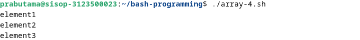

### Akses elemen pertama array
Dalam elemen Array, indeks elemen Pertama adalah nol, dan array[0] mengembalikan elemen pertama

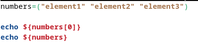

Output: 


### Cetak semua elemen array
For loop digunakan untuk mengulangi elemen.
Berikut adalah contoh contoh loop array untuk mencetak semua elemen


Output: 


Cara lain untuk mencetak


Output: 


Gunakan [@] atau [*] untuk mencetak semua elemen array.


Output: 


### Hapus elemen dari array
Anda dapat menghapus elemen dari array menggunakan unsetindeks tertentu.

    numbers=("element1" "element2" "element3")
    echo ${numbers[*]}
    unset numbers[-1]
    echo ${numbers[*]}

### Menambahkan elemen ke dalam array
Anda dapat menambahkan elemen di posisi indeks mana pun menggunakan sintaksis di bawah ini.


Output: 


### Panjang sebuah array
Skrip shell menyediakan #


Output: 


## Ekspansion
Cara menulis skrip shell di bash

- Pilih Editor atau editor teks
- Buat file dengan ekstensi .sh atau .bash
- Tulis perintah dalam file
- Simpan file sebagai `hello.sh`

        #!/bin/bash
        echo "Hello World"

Ubah izin untuk mengeksekusi file


    chmod +x hello.sh

## Conditional Expression
Bash menyediakan operator logika pada FIle dan direktori untuk menguji ekspresi kondisional. Ini memungkinkan Anda untuk memeriksa berbagai operasi seperti keberadaan, dan izin, ukuran. Ini digunakan ekspresi kondisional dalam pernyataan kondisional seperti if else dan case.


Output: 


## Case-Statement
pernyataan case mirip dengan switch case dalam bahasa pemrograman lain.

Ini digunakan untuk membandingkan masukan yang diberikan dengan beberapa pola, dan perintah di dalam pola yang cocok dijalankan.

- ekspresi adalah variabel atau ekspresi yang valid untuk dievaluasi
- Ini berisi pola defiend di dalam case yang dievaluasi dengan membandingkan ekspresi, mencocokkan case fuound, mengeksekusi perintah di dalamnya.
- case default ( *)) untuk dieksekusi jika tidak ada pola yang cocok
- Setiap blok pola diakhiri dengan a;;
- case adalah kata awal dan esacmerupakan kata yang mengakhiri pernyataan kasus

Ini sebuah contoh: 


Output:

 

## Special Character
Karakter khusus di bash dievaluasi dengan arti khusus dalam interpretasi suatu perintah. Karakter-karakter ini memiliki instruksi khusus, penggunaan karakter ini memiliki arti berbeda dalam konteks berbeda

### Ruang kosong(" "):
Ini juga disebut spasi putih, berisi tab, spasi, kembali, baris baru. Ini memberitahu penerjemah bash untuk memisahkan perintah dan konten. Ini adalah pembatas untuk memisahkan perintah dan string.

### Ekspansi($)
Simbol tanda dolar digunakan untuk berbagai jenis ekspansi parameter ekspansi, ( $variable, ${variable}) Substitusi ( $(expression)) ekspresi artematis ( $((expression)))

### Ambersand (&)
Menambahkan &ke akhir perintah memungkinkan Anda menjalankan perintah di latar belakang.

### Pipa ( | )
Ini digunakan untuk meneruskan keluaran dari satu perintah ke masukan ke perintah lain dari kiri ke kanan. Hal ini memungkinkan untuk membentuk rantai perintah

Sintaksnya adalahcommand1 | command2

Contoh : echo "hello" | wcmengembalikan jumlah karakter.

### Titik koma(;)
Ini digunakan untuk memisahkan beberapa perintah menggunakan ;satu baris. ;adalah pemisah perintah untuk mendefinisikan beberapa perintah dalam satu baris Sintaks:command1; command2;command3

Contoh:cd /app/;ls;

### Kutipan tunggal
Tanda kutip tunggal ( ') digunakan untuk mendefinisikan suatu string tanpa arti khusus. Artinya semua variabel dan ekspansi tidak diinterpretasikan dan mencetak string literal yang sama

 

Output

 

Contoh, echo pertama, variabel nama diperluas dan diinterpretasikan sebagai string dan dicetak. 
echo kedua, menggunakan tanda kutip tunggal, dan variabel nama tidak diperluas dan dicetak sebagai string literal.

Jika kutipan tunggal berisi quoe tunggal bersarang, Anda harus menghindarinya menggunakan ```.

 

output: 

 

Contoh berisi ``` adalah karakter kutipan tunggal di dalam kutipan tunggal

### Kutipan ganda
Tanda kutip ganda ( ') digunakan untuk mendefinisikan string literal dengan arti khusus.

jika string berisi variabel dan sintaks perluasan, Ini diinterprestasikan dan diperluas, dengan nilai yang dievaluasi saat runtime.

jika string tidak ingin memperluas variabelnya, maka Anda dapat keluar \sebelum $simbol dolar

 

output: 

 

Contoh, echo pertama, variabel nama diperluas dan diinterpretasikan sebagai string dan dicetak. echo kedua, karakter escape dengan awalan $ \, dicetak sebagai string literal.

Karakter Garis Miring Balik( \)

Karakter garis miring terbalik digunakan untuk keluar dari karakter dalam string. ini digunakan dalam string yang dikutip ganda.

 

output: 


Pada contoh pertama, echo berisi `$$`, yang menampilkan id proses. Pada contoh kedua, echo berisi `\$$`, yang ditampilkan $$sebagai string literal. karakter escape diawali.
     
### Komentar ( #)
Simbol komentar digunakan untuk mengomentari sebaris kode. Baris komentar selalu dimulai dengan #.

Itu diabaikan oleh penerjemah bash.


output

 

### Tanda tanya( ?)
tanda tanya mempunyai arti yang berbeda dalam konteksnya.
- Dalam konteks ekspresi reguler
- Di dalam

### If Elif Else

- Kondisi adalah ekspresi yang mengevaluasi trueatau falsedalam skrip shell.
- Spasi diperlukan sebelum dan sesudah [ dan ].
- Diperlukan titik koma sebelum itu.
- if, else, then, elif, fiadalah kata-kata khusus di Bash.
- Kondisi adalah ekspresi dengan perintah.
  - Perintah yang berisi sintaks tanda kurung tunggal, contoh sintaksis [expression]dan digunakan untuk operasi string file.
  - Sintaks tanda kurung ganda, contohnya adalah [[expression]], yang digunakan untuk menggabungkan beberapa kondisi dan menangani pola regex.
  - Tanda kurung ganda, contoh sintaksnya adalah ((expression)), digunakan untuk operasi aritmatika.

Contoh penggunaan

 

Output: 

 

Program di atas menunjukkan penggunaan pengkondisian di pemorograman bash menggunakan -lt sebagai pembanding lebih kecil dari 

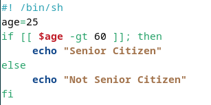 

Output: 


Program di atas menunjukkan penggunaan pengkondisian di pemorograman bash menggunakan -gt sebagai pembanding lebih kecil dari 


Output:


Program di atas menunjukkan penggunaan pengkondisian di pemorograman bash menggunakan -gt, jika nilai tidak memenuhi maka akan di cek di kondisi ke dua menggunakan -lt sebagai pembanding lebih kecil dari 


## Loops
Contoh ini mengulangi daftar dan mencetak ke konsol.

 

Output: 

 

### untuk loop indeks
untuk loop indeks mirip dengan bahasa C untuk loop indeks. Ini mengeksekusi kode beberapa kali berdasarkan kondisi benar, Ini dimulai dengan nilai awal dan iterasi berisi nilai yang akan bertambah 1.

 

Output

 

### While loop di bash
Perulangan whiledi Bash memungkinkan eksekusi kode berulang selama kondisi yang ditentukan adalah true. Jika kondisinya menjadi false, perulangan akan keluar.

Struktur dasar perulangan while adalah sebagai berikut:

 

Output: 

 

while loop mengeksekusi kode selama kondisi yang ditentukan ( [[ i -lt 100 ]]) benar.

Blok kode menambah nilai sebesar 1 dan mencetak nilainya.

jika kondisi salah, loop keluar.

### Until loops di bash
Kata untilkunci di Bash digunakan untuk mengeksekusi kode berulang kali hingga kondisi tertentu menjadi true, di mana loop keluar.
`until` digunakan di Bash dan diakhiri dengan `done`.


Output:


Dalam contoh ini, blok kode dijalankan selama [[ i -eq 100 ]]bernilai salah. Ini menambah nilai sebesar 1 dan mencetak nilainya.
output mencetak angka dari 0 hingga 99 angka

## Append String 
### Bash Arthematic expressions
Arthematic expressions digunakan untuk melakukan operasi matematika

ekspresi adalah istilah yang digunakan dalam matematika untuk menunjukkan suatu operasi. Ini berisi operan dan operator untuk melakukan operasi matematika. a<badalah sebuah ekspresi. Ini mungkin berisi operator biner atau unary

Di bash, Expressions dibuat menggunakan (()) tanda kurung dengan operan dan operator sebagai argumen. ((a )) adalah ekspresi bash. Expressions adalah operasi matematika, dapat berisi sub ekspresi yang dipisahkan dengan koma.

Contoh: 

 

Output: 

 

Arthematic expressions dibuat menggunakan operator dibawah ini

- Operator Aritmatik
- Operator Perbandingan
- Operator Logis

Operator Bersyarat
Operator perbandingan digunakan untuk mengecek satu sama lain dengan membandingkan nilai operator (<, <=, >, >=, ==, !=)

Contoh: 

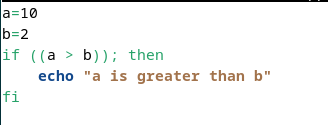 

Output: 

 

### Bash Arithmetic Expansion
Expansion sama dengan Expression, yaitu digunakan untuk menghitung nilai expression dan hasilnya diganti dengan nilai dan selalu diawali dengan tanda dolar.

    $((expression))
Contoh menghitung nilai rata-rata menggunakan expansion. Setelah perhitungan dilakukan, output diganti dengan ekspresi.

 

Output: 

 

### Penambahan variabel sederhana
Contoh penambahan string

 

Output: 

 

Contoh lain melibatkan penggabungan string ke variabel yang sama dan mencetaknya ke konsol:

 

Output: 

 

### Gunakan Operator Aritmatika Singkatan
Operator aritmatika singkat ( +=) biasanya digunakan dalam aritmatika untuk menambahkan nilai ke suatu variabel. Ini juga dapat digunakan untuk string untuk menambahkan string ke variabel.

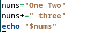

Output: 

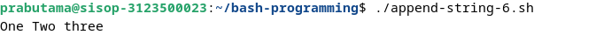 

#### Gunakan perintah printf
printfdigunakan untuk memformat string dengan berbagai opsi pemformatan yang kompleks. Kita dapat menggunakan printfperintah untuk menggabungkan string. Formatnya adalah %s%s,menambahkan dua variabel string.


Output: 

 

### Menggunakan here string
Here stringsadalah sintaks khusus untuk meneruskan string ke perintah dalam skrip Bash. Mereka digunakan untuk meneruskan string input tanpa menggunakan sumber lain, seperti file. Ini memungkinkan meneruskan string ke perintah Bash apa pun dari file atau baris perintah.


Output: 

 

## Functions
Contoh penggunaan fungsi dengan menggunakan parameter

 

Output: 

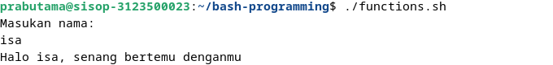

## Operators

### Operator Aritmatika Bash
Operator aritmatika di Bash menyediakan operasi aritmatika seperti operator penjumlahan, pembagian, pengurangan, dan perkalian pembagian.


#### Operator Penugasan
Operator penugasan digunakan untuk menetapkan nilai ke suatu variabel. Operasi dasarnya sama dengan (=)

Selain itu, Ada operator penugasan lainnya.

misalnya, p adalah 20


### Operator Bitwise


Contoh penggunaan operator di bash

 

Output: 

 

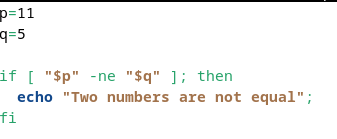 

Output: 


## Number Comparations

Program ini mengambil nilai masukan dan memeriksa apakah dua nilai sama atau tidak.

 

Berikut ini adalah operator Perbandingan.

- -eq: setara
   - Periksa apakah dua variabel sama
- -ne: Tidak sama
   - Periksa apakah dua variabel tidak sama
- -lt: Kurang dari
   - Periksa apakah variabel pertama lebih kecil dari variabel kedua
- -le: Kurang dari sama
   - Periksa apakah variabel pertama kurang dari sama dengan variabel kedua
- -gt: Lebih besar dari
   - Periksa apakah variabel pertama lebih besar dari variabel kedua
-ge: Lebih besar dari atau sama dengan 
   - Bandingkan Periksa apakah variabel pertama lebih besar dari sama dengan variabel kedua

menggunakan operator -eq dalam if fipernyataan kondisional

 

Anda juga dapat melakukannya dengan operator ternary.


## Check Directory
- periksa direktori yang ada dan cetak pesannya. Ekspresi kondisional berisi -dopsi dan jalur direktori. -dopsi yang memeriksa apakah direktori ada atau tidak.

contoh: 

 

Output: 

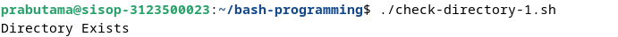 

- Bagaimana cara mkdir hanya jika direktori belum ada?
Dalam contoh ini, menggunakan blok kondisional if-else.
- Diperiksa apakah direktori tersebut ada menggunakan -d.
- else blok akan memiliki kode untuk tidak ada dan membuat direktori menggunakan jalur direktori

Alternatifnya, ekspresi kondisional ternary digunakan sebagai pengganti ekspresi kondisional if

 

Output: 

 

Periksa apakah ada banyak direktori Terkadang, Kami ingin memeriksa apakah ada banyak direktori.
Kita harus menggunakan pernyataan kondisional if dengan operator logika AND(&&).

 

Output: 

 

-  Periksa apakah direktori ada dan dapat ditulis serta dieksekusi

Dalam contoh ini, Kode memeriksa hal-hal di bawah ini

foldernya ada atau tidak
jika ada, Folder tersebut memiliki izin untuk menulis dan dieksekusi.
Terakhir, Cetak pesan string


Output: 


Periksa file atau direktori yang ada
Terkadang, kami ingin memeriksa apakah file atau direktori tersebut ada. Opsi -e memeriksa file atau direktori untuk jalur yang diberikan ada atau tidak.`


Output: 


## File Name

### Ekstrak nama file dengan ekstensi
Untuk mendapatkan nama file beserta ekstensinya, basenameperintah dapat digunakan untuk menghapus direktori dan hanya mengembalikan nama filenameuntuk jalur tertentu, baik itu a variableatau string.

Misalnya, jika jalurnya adalah /home/john/run.sh, nama file yang dikembalikan adalah run.sh. Proses ini melibatkan pengambilan jalur lengkap dan hanya mengekstraksi jalur tersebut filenamedengan menghapus jalur tersebut. Hasilnya filenamekemudian disimpan dalam variabel dan dicetak ke konsol.

nama dasar digunakan untuk menghapus direktori dan mengembalikan nama file untuk jalur yang diberikan. jalurnya adalah variabel atau string. Misalnya, jalurnya adalah /home/john/run.sh, dan nama file yang dikembalikan adalah. run.sh Dalam hal ini, jalur lengkap diberikan dan mengembalikan nama file dengan menghapus jalurnya.

Nama file disimpan ke variabel dan dicetak ke konsol.

 

Output: 

 

### Ekstrak nama file tanpa ekstensi
Untuk mendapatkan hanya nama file tanpa ekstensi, Anda dapat menggunakan sintaksis ${filename%.*}.

Misalnya, pertimbangkan jalur /home/john/run.shyang akan menjadi nama file yang dihasilkan run.sh.

Awalnya, basenameperintah ini digunakan untuk menghilangkan direktori dan menghasilkan nama file untuk jalur yang ditentukan dan mengembalikan variabel, dan variabel ini kemudian digunakan bersama dengan sintaks ekspresi untuk menghapus ekstensi dari nama file.

 

Output: 

 

### Ekstrak ekstensi untuk jalur file
Untuk mengisolasi ekstensi file dari jalur file yang diberikan, ${filename##*.}dapat dimanfaatkan. Ekspresi ini hanya mengembalikan ekstensi file.

Misalnya, pertimbangkan jalur /home/john/run.shyang akan menjadi ekstensi yang dihasilkan sh.

Awalnya, basenameperintah ini digunakan untuk menghapus jalur direktori dan mengembalikan nama file untuk jalur yang ditentukan, dan nama file ini kemudian digunakan bersama dengan sintaks ekspresi untuk mengembalikan ekstensi saja.

 

Output: 


## Split String

### Pisahkan string menggunakan perintah awk dalam skrip bash shell
Perintah tersebut awk, sebuah utilitas Linux yang kompatibel dengan semua distribusi bash dan shell, digunakan untuk membagi string berdasarkan delimiter.

Input diberikan menggunakan simbol pipa (|), dan contoh di bawah ini menunjukkan pemisahan string yang mengandung titik dua ( :)

 

Output: 

 

### dibagi menggunakan variabel IFS
Di sini, string masukan terdiri dari elemen yang dipisahkan oleh hyphens. Variabel shell IFS(Pemisah Bidang Internal) diatur ke tanda hubung, dan string diiterasi menggunakan perulangan for.

Setiap elemen dicetak setelah tanda hubung dihilangkan.

 

Output: 

 

### Gunakan ekspansi Parameter dan loop
Perluasan parameter digunakan untuk mengubah nilai variabel berdasarkan opsi yang ditentukan. Dalam hal ini, variabel string diubah menjadi array. Array kemudian diiterasi menggunakan sintaks for loop, mencetak setiap elemen ke konsol:

 

Output: 


## String Length 
### Menggunakan Sintaks ${#variable}
Metode pertama melibatkan penggunaan ${#variable}sintaksis untuk mendapatkan panjang variabel string.

 

Output: 

 

### Menggunakan Perintah wc -m
Metode kedua melibatkan penggunaan perintah wc -m, baik secara langsung dengan string atau melalui variabel.

 

Output: 

 

### Menggunakan exprPerintah Metode lain melibatkan penggunaan exprperintah untuk mencari panjang string.

`$(expr length "$msg")`mengembalikan jumlah karakter dalam string, ditetapkan ke variabel, nilai variabel dicetak ke konsol

 

Output: 

 

### menggunakan perintah awk Awkmenyediakan cara lain untuk menghitung panjang string menggunakan ekspresi.
Dalam hal ini, echo -n "$variable"keluaran string tanpa baris baru, dan keluaran disalurkan awkmenggunakan simbol pipa( |). Perintah awk '{print length}'menghitung dan mencetak panjang baris input.


 

Output: 


## Bashrc
### Bagaimana cara melihat file .bashrc?
Anda dapat menggunakan editor Vi atau Nano untuk melihat file bashrc.

Berikut ini adalah sebuah perintah

    nano ~/.bashrc
    nano ~/.bashrc

Output

 

Cara lain:


## Ternary Operators
### Cara menggunakan Operator ternary di Bash
Ada beberapa cara kita dapat menulis sintaksis sebagai pengganti sintaksis operator ternary.

Cara pertama, gunakan if-else dengan sintaks ekspresi.
Contoh: 

 

Output: 


Ada cara lain untuk menetapkan variabel, bukan ekspresi.

dengan menggunakan mari kita dapat menetapkan variabel berdasarkan hasil ekspresi kondisi

 

Output: 


## Lower Case
### menggunakan perintah tr
Perintah tr, kependekan dari translator, adalah perintah Unix yang digunakan untuk mengonversi karakter dari satu format ke format lainnya.
Sintaksnya adalah sebagai berikut:

 

Output: 

 

Alternatif: 

 

Output: 

 

Catatan: `tr` berfungsi dengan ASCII dan tidak mendukung UTFkarakter.

### menggunakan perintah awk
Untuk mengubah string menjadi huruf kecil menggunakan awkperintah, tolowerfungsinya digabungkan dengan awk.

Hasilnya kemudian diteruskan ke perintah echo menggunakan operator pipa:

 

Output: 

 

- Gunakan Perl di Bash Script Printing lcdengan Perlmengubah string menjadi huruf kecil.

 

### gunakan ekspansi Parameter 
Bash 4.0 memperkenalkan utilitas manipulasi string bawaan. Untuk mengonversi string menjadi huruf kecil, cukup tambahkan dua commaske string. Ini juga disebut sintaks perluasan parameter.
Sintaksnya adalah ${variable[options]}.

 

Output: 

 

Contoh lain:


Output: 


## Uppercase
### menggunakan perintah tr
Perintah tersebut tr, yang dikenal sebagai translator, adalah perintah Unix yang digunakan untuk mengonversi karakter dari satu format ke format lainnya.
Sintaksnya adalah sebagai berikut:

 

Output: 


Cara lain:

 

Output: 

 

### menggunakan perintah awk
Untuk mengubah string menjadi huruf besar menggunakan awkperintah, toupperfungsinya digabungkan dengan awk. Hasilnya kemudian diteruskan ke perintah echo menggunakan operator pipa:

 

Output: 


### dalam versi bash 4.0 
bash 4.0 menyediakan utilitas manipulasi string bawaan. Menambahkan dua tanda sirkumfleks (^) ke sebuah string akan membuat string menjadi string huruf besar.

 

Output: 

 

### menggunakan Perl dalam skrip bash
print ucperintah di Perl mengubah string menjadi huruf besar

 

### Gunakan sintaks perluasan parameter 
Bash 4.0 menyediakan utilitas manipulasi string bawaan. Menambahkan dua tanda sirkumfleks (^) ke sebuah string menjadikannya string huruf besar, juga disebut sintaks perluasan parameter.

 

Output: 


## Substring
### Menggunakan Operator Perbandingan untuk Memeriksa Substring ada atau tidak
- Tentukan variabel string yang berisi teks.
- Gunakan pernyataan if untuk membandingkan string dengan substring yang diinginkan menggunakan operator kesetaraan ( ==) dan wildcard (*).
- Terakhir, cetak string jika substring ditemukan.

 

Output: 

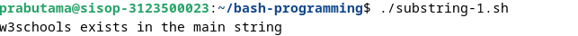 

### Gunakan Ekspresi Reguler untuk Menemukan Substring
Operator =~ memfasilitasi pencarian substring dalam string tertentu, digunakan dalam blok if.

Contoh kode:

 

Output: 

 

### Gunakan perintah grep
Perintah grep digunakan untuk mencari string tertentu, disalurkan ke string utama untuk perbandingan.

 

Output: 


## Variable Set


### Bagaimana cara memeriksa apakah suatu variabel diatur dalam skrip bash?
Misalnya variabelnya diset artinya,
Itu dideklarasikan dan ditetapkan dengan kosong atau tidak kosong.

Dalam contoh di bawah ini,
- `variable1` dideklarasikan tetapi kosong
- `variable2` tidak dideklarasikan dan tidak disetel.

 

Output: 

 

Cara lain untuk memeriksa suatu variabel adalah dengan menyetel menggunakan -v 

 

Output: 

 

### memeriksa apakah variabel tidak disetel di skrip bash?
Misalnya variabelnya tidak disetel artinya

Itu tidak ada dan tidak dideklarasikan.
Dalam contoh di bawah ini,

variable1dideklarasikan tetapi kosong
variable2tidak dideklarasikan dan tidak disetel

 

Output: 

 

### Mengecek variabel kosong atau tidak kosong
memeriksa pemeriksaan variabel dibandingkan dengan spasi dan membungkus ekspresi ini di dalam [[]].

 

Output: 

 

Hal yang sama juga dapat ditulis menggunakan variabel dalam tanda kutip ganda yang dibungkus dalam tanda kurung tunggal [].

 

Output: 

 

periksa juga untuk tidak mengosongkan menggunakan! operator.

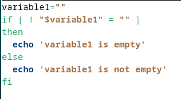 

Output: 

 

Opsi penggunaan -z lainnya untuk memeriksa variabel disetel dan kosong atau tidak kosong menggunakan kode di bawah ini

 

Output: 


## Iterate Nos
### Hasilkan serangkaian angka dalam skrip bash

menggunakan `seq` menghasilkan urutan angka.

 

Output: 

 

### menggunakan perulangan for

 

Output: 

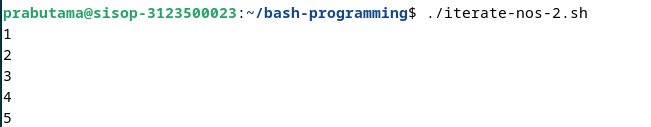 

### While Loop

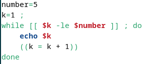 

Output: 

 


